# AI SDK Adapter Validation Pipeline

This plan creates a complete validation pipeline from real SDK captures to visual UI verification.

## Architecture Overview

```mermaid
flowchart LR
    subgraph Phase1 [Phase 1: Fixture Conversion]
        A[raw-sdk-capture.json] --> B[Fixture Converter Script]
        B --> C[FixtureFile Format]
    end
    
    subgraph Phase2 [Phase 2: Event Capture]
        C --> D[createMockQuery]
        D --> E[createClaudeNode]
        E --> F[RuntimeEvents]
        F --> G[ai-sdk-fixtures.json]
    end
    
    subgraph Phase3 [Phase 3: Test Update]
        G --> H[Updated Unit Tests]
        H --> I[Updated Integration Tests]
    end
    
    subgraph Phase4 [Phase 4: UI Demo]
        G --> J[MockRuntime]
        J --> K[OpenHarnessChatTransport]
        K --> L[useChat Hook]
        L --> M[Demo Page]
    end
    
    subgraph Phase5 [Phase 5: Visual Validation]
        M --> N[Dev Server]
        N --> O[Browser Navigate]
        O --> P[Screenshot Validation]
    end
```



## Phase 1: Convert Raw SDK Capture to FixtureFile Format

Create script at [`packages/sdk/scripts/convert-raw-to-fixture.ts`](packages/sdk/scripts/convert-raw-to-fixture.ts):

- Read [`packages/sdk/tests/fixtures/recordings/captured/raw-sdk-capture.json`](packages/sdk/tests/fixtures/recordings/captured/raw-sdk-capture.json)
- Extract `messages` array (excluding metadata) as `events`
- Extract `result` message to build `output` (text, usage, sessionId, etc.)
- Extract `prompt` field to build `input`
- Output as `FixtureFile` format compatible with `createMockQuery`

**Validation Gate:**

```bash
cd packages/sdk && bun run typecheck && bun run lint
```

## Phase 2: Capture RuntimeEvents from Mock Replay

Create script at [`packages/ai-sdk/scripts/capture-runtime-events.ts`](packages/ai-sdk/scripts/capture-runtime-events.ts):

- Load the converted fixture
- Create `MockQuery` using `createMockQuery` from SDK
- Create `ClaudeNode` with `queryFn: mockQuery`
- Run the node and capture all emitted `RuntimeEvents`:
  - `agent:start`, `agent:text:delta`, `agent:thinking:delta`
  - `agent:tool`, `agent:text`, `agent:thinking`
  - `agent:complete`, `agent:paused`, `agent:aborted`
- Save captured events to [`packages/ai-sdk/tests/fixtures/runtime-events.json`](packages/ai-sdk/tests/fixtures/runtime-events.json)

**Validation Gate:**

```bash
cd packages/ai-sdk && bun run typecheck && bun run lint
```

## Phase 3: Update AI SDK Tests with Real Fixtures

Update tests in [`packages/ai-sdk/tests/`](packages/ai-sdk/tests/):

1. **Unit tests** ([`tests/unit/transforms.test.ts`](packages/ai-sdk/tests/unit/transforms.test.ts)):

   - Replace fabricated event data with events from `runtime-events.json`
   - Test all event types: text, thinking, tool calls, errors

2. **Integration tests** ([`tests/integration/transport.test.ts`](packages/ai-sdk/tests/integration/transport.test.ts)):

   - Create `MockRuntime` that replays captured `RuntimeEvents`
   - Verify full stream lifecycle with real event sequences

**Validation Gate:**

```bash
cd packages/ai-sdk && bun run test && bun run typecheck && bun run lint
```

## Phase 4: Build UI Demo Page

1. **Add dependency** to [`apps/ui/package.json`](apps/ui/package.json):
   ```json
   "@open-harness/ai-sdk": "workspace:*",
   "@open-harness/sdk": "workspace:*"
   ```

2. **Create MockRuntime** at [`apps/ui/src/lib/mock-runtime.ts`](apps/ui/src/lib/mock-runtime.ts):

   - Implements `Runtime` interface
   - Replays captured `RuntimeEvents` on demand
   - Supports `dispatch()` to trigger replay

3. **Create demo page** at [`apps/ui/src/app/demo/page.tsx`](apps/ui/src/app/demo/page.tsx):

   - Uses `useChat()` with `OpenHarnessChatTransport`
   - Renders streaming text, thinking blocks, tool calls
   - Beautiful UI with streaming indicators

4. **Copy fixtures** to [`apps/ui/src/fixtures/runtime-events.json`](apps/ui/src/fixtures/runtime-events.json)

**Validation Gate:**

```bash
cd apps/ui && bun run build && bun run lint
```

## Phase 5: Visual Validation with Browser Tools

1. **Start dev server**:
   ```bash
   cd apps/ui && bun run dev
   ```

2. **Navigate to demo page**:

   - Use `browser_navigate` to open `http://localhost:3000/demo`

3. **Capture snapshot**:

   - Use `browser_snapshot` to get page accessibility tree
   - Verify key elements present:
     - Chat input field
     - Message list
     - Streaming text content

4. **Interact and validate**:

   - Type a message using `browser_type`
   - Submit and wait for response
   - Take screenshot with `browser_take_screenshot`
   - Verify streaming text, thinking blocks, tool indicators render

5. **Final screenshot comparison**:

   - Visual confirmation that chunks render correctly
   - Text streaming shows progressive updates
   - Tool calls display with name and result

**Validation Gate:**

- Screenshot shows rendered chat UI with streaming content
- No console errors
- Correct visual hierarchy

## Event Coverage Matrix

The captured fixtures must include these event types:

| Event Type | Source in raw-sdk-capture | UI Chunk Output |

|------------|---------------------------|-----------------|

| `agent:text:delta` | `text_delta` stream events | `text-delta` |

| `agent:text` | `assistant.content[type=text] `| `text-end` |

| `agent:thinking:delta` | `thinking_delta` stream events | `reasoning-delta` |

| `agent:thinking` | `assistant.content[type=thinking] `| `reasoning-end` |

| `agent:tool` | `tool_use` + `tool_result` | `tool-input-available`, `tool-output-available` |

| `agent:complete` | `result` message | `data-flow-status: complete` |

## Files Created/Modified

| File | Action |

|------|--------|

| `packages/sdk/scripts/convert-raw-to-fixture.ts` | Create |

| `packages/ai-sdk/scripts/capture-runtime-events.ts` | Create |

| `packages/ai-sdk/tests/fixtures/runtime-events.json` | Create |

| `packages/ai-sdk/tests/unit/transforms.test.ts` | Update |

| `packages/ai-sdk/tests/integration/transport.test.ts` | Update |

| `apps/ui/package.json` | Update |

| `apps/ui/src/lib/mock-runtime.ts` | Create |

| `apps/ui/src/app/demo/page.tsx` | Create |

| `apps/ui/src/fixtures/runtime-events.json` | Create |