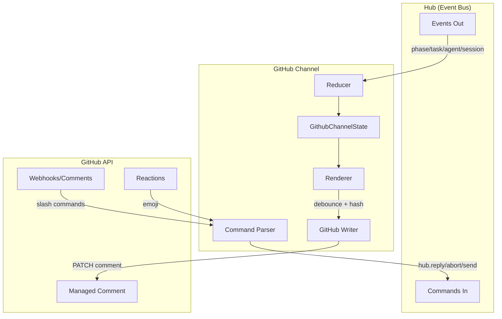

# GitHub Channel Implementation Plan

## Architecture Overview



## Package Structure

```
packages/github-channel/
├── README.md                    (exists)
├── package.json                 (create)
├── tsconfig.json                (create)
├── biome.jsonc                  (create)
├── index.ts                     (create - exports)
├── spec/
│   ├── github-channel.md        (exists)
│   ├── github-channel-architecture.md (exists)
│   └── github-channel-implementation-manifest.md (exists)
├── src/
│   ├── types.ts                 (state, config, events)
│   ├── reducer.ts               (events → state)
│   ├── renderer.ts              (state → markdown)
│   ├── parser.ts                (commands + reactions)
│   ├── writer.ts                (GitHub client)
│   └── channel.ts               (attachment wiring)
└── tests/
    ├── reducer.test.ts
    ├── renderer.test.ts
    ├── parser.test.ts
    ├── writer.test.ts
    └── integration.test.ts
```

---

## Phase 0: Package Scaffolding

**Agent responsibility**

Create config files modeled on [packages/rtv-channel/package.json](packages/rtv-channel/package.json):

- `package.json` with name `@openharness/github-channel`, scripts for `test`, `lint`, `typecheck`
- `tsconfig.json` with strict mode (copy from rtv-channel)
- `biome.jsonc` (copy from rtv-channel)
- `index.ts` barrel export

Dependencies needed:

- `@octokit/rest` or native fetch for GitHub API
- `pino` for logging
- Dev: `@biomejs/biome`, `@types/bun`, `typescript`

---

## Phase 1: Core Types

**Agent responsibility**

Create `src/types.ts` with:

```typescript
// Config
export type GithubChannelConfig = {
  repo: string;
  issueNumber?: number;
  prNumber?: number;
  tokenEnv: string;
  mentions?: string[];
  debounceMs?: number;    // default 3000
  maxRecent?: number;     // default 50
  allowCommands?: string[];
};

// State (curated)
export type GithubChannelState = {
  run: { id: string | null; status: "idle"|"running"|"paused"|"complete"|"aborted" };
  phase: { name: string | null; number?: number; status: "idle"|"running"|"complete"|"failed" };
  tasks: Array<{ id: string; label?: string; state: "pending"|"running"|"done"|"failed"; summary?: string }>;
  agents: Array<{ name: string; runId?: string; status?: string; last?: string }>;
  prompts: Array<{ promptId: string; prompt: string; choices?: string[]; allowText?: boolean; status: "open"|"answered"; from?: string }>;
  recent: Array<{ ts: string; type: string; text?: string }>;
  errors: Array<{ ts: string; message: string }>;
  summary?: string;
  updatedAt: string;
};

// Hub types (import from kernel or define locally)
export type { Hub, Attachment, BaseEvent, EnrichedEvent } from "./hub-types";
```

---

## Phase 2: Reducer Implementation

**Agent responsibility**

Create `src/reducer.ts`:

- Pure function: `reduce(state: GithubChannelState, event: EnrichedEvent): GithubChannelState`
- Handle event types:
  - `phase:start/complete/failed` - update phase status
  - `task:start/complete/failed` - upsert task in tasks array
  - `agent:start/thinking/text/tool:start/tool:complete/complete` - upsert agent, push to recent
  - `session:prompt` - push prompt with status=open
  - `session:reply` - mark prompt answered
  - `session:abort` - set run.status=aborted
  - `narrative` - push to recent
- Enforce `maxRecent` cap; overflow into `summary` (rolling abstract)
- Update `updatedAt` on every reduction

Unit tests in `tests/reducer.test.ts`:

- Each event type produces expected state delta
- Recent window caps correctly
- Summary roll-up on overflow

---

## Phase 3: Renderer Implementation

**Agent responsibility**

Create `src/renderer.ts`:

- Pure function: `render(state: GithubChannelState): string`
- Output markdown with sentinel block:
```markdown
<!-- DASHBOARD:START -->
## Workflow Dashboard
**Status**: running | **Phase**: Planning | **Updated**: 2026-01-01T12:00:00Z

### Tasks
| ID | State | Summary |
|----|-------|---------|
| task-1 | done | Completed successfully |
| task-2 | running | In progress... |

### Agents
| Name | Status | Last |
|------|--------|------|
| planner | complete | Generated 3 tasks |

### Prompts (Needs Attention)
- **prompt-123**: "Which approach?" [A, B, C] @maintainer

### Recent Activity
- 12:00:01 phase:start Planning
- 12:00:05 agent:text "Analyzing..."

### Errors
(none)

---
**Commands**: `/pause` `/resume` `/abort <reason>` `/reply <id> <text>` `/choose <id> <choice>` `/status` `/help`
**Reactions**: ✅ confirm | ⏸️ pause | ▶️ resume | 🛑 abort | 🔁 retry
<!-- DASHBOARD:END -->
```

- Include `hashContent(rendered): string` function for idempotency checks
- Truncate long text (tasks summary, agent last, recent entries)

Unit tests in `tests/renderer.test.ts`:

- Snapshot tests for various state shapes
- Hash stability (same state = same hash)
- Truncation behavior

---

## Phase 4: Command Parser

**Agent responsibility**

Create `src/parser.ts`:

```typescript
type ParsedCommand =
  | { type: "pause" }
  | { type: "resume" }
  | { type: "abort"; reason?: string }
  | { type: "status" }
  | { type: "reply"; promptId: string; text: string }
  | { type: "choose"; promptId: string; choice: string }
  | { type: "help" }
  | { type: "unknown" };

export function parseSlashCommand(text: string, allowlist: string[]): ParsedCommand | null;

type ParsedReaction =
  | { type: "confirm" }    // ✅
  | { type: "pause" }      // ⏸️
  | { type: "resume" }     // ▶️
  | { type: "abort" }      // 🛑
  | { type: "retry" }      // 🔁
  | { type: "thumbsUp" }   // 👍
  | { type: "thumbsDown" } // 👎
  | { type: "unknown" };

export function parseReaction(emoji: string): ParsedReaction;
```

- Enforce allowlist for slash commands
- Return `null` for non-command comments (no leading `/`)

Unit tests in `tests/parser.test.ts`:

- All slash commands parsed correctly
- Allowlist enforcement
- All reaction emojis mapped
- Edge cases (malformed commands, extra whitespace)

---

## Phase 5: GitHub Writer

**Agent responsibility**

Create `src/writer.ts`:

```typescript
export type WriterConfig = {
  repo: string;
  issueNumber?: number;
  prNumber?: number;
  token: string;
  debounceMs: number;
};

export class GithubWriter {
  private commentId: number | null = null;
  private lastHash: string | null = null;
  private debounceTimer: Timer | null = null;

  constructor(private config: WriterConfig, private logger: Logger);

  // Find or create the managed comment
  async ensureComment(): Promise<number>;

  // Update the sentinel block (debounced, hash-guarded)
  queueUpdate(rendered: string): void;

  // Immediate write (used internally after debounce)
  private async writeComment(rendered: string): Promise<void>;

  // Cleanup
  async deleteComment(): Promise<void>;
}
```

Key behaviors:

- On first call, search for existing comment with sentinel; create if missing
- Debounce writes by `debounceMs`
- Hash guard: skip write if `hashContent(rendered) === lastHash`
- Retry with exponential backoff on 5xx; stop on 401/403
- Emit `channel:error` event on persistent failure

Integration tests in `tests/writer.test.ts` (mock GitHub API):

- Debounce coalesces multiple rapid updates
- Hash guard skips no-op writes
- Retry logic on transient errors
- Sentinel recreation on missing comment

---

## Phase 6: Channel Attachment Wiring

**Agent responsibility**

Create `src/channel.ts`:

```typescript
import type { Attachment, Hub } from "./types";
import { reduce, initialState } from "./reducer";
import { render, hashContent } from "./renderer";
import { GithubWriter } from "./writer";
import { parseSlashCommand, parseReaction } from "./parser";

export function createGithubChannel(config: GithubChannelConfig): Attachment {
  return (hub: Hub) => {
    let state = initialState();
    const writer = new GithubWriter({ ... }, logger);

    // Subscribe to events
    const unsubscribe = hub.subscribe(
      ["phase:*", "task:*", "agent:*", "session:*", "narrative"],
      (event) => {
        state = reduce(state, event);
        const rendered = render(state);
        writer.queueUpdate(rendered);
      }
    );

    // TODO: webhook listener for comments/reactions (Phase 7 or external)

    // Cleanup
    return async () => {
      unsubscribe();
      // optionally delete comment on shutdown
    };
  };
}
```

Export from `index.ts`:

```typescript
export { createGithubChannel } from "./src/channel";
export type { GithubChannelConfig, GithubChannelState } from "./src/types";
```

---

## Phase 7: Offline Integration Test

**Agent responsibility**

Create `tests/integration.test.ts`:

- Simulated hub emits scripted events over ~60s (phases, tasks, agents, prompts, narratives)
- Assert:
  - State evolves correctly
  - Writer receives expected number of calls (throttled)
  - Prompt lifecycle (open → answered)
  - Recent window caps at `maxRecent`
  - Summary roll-up on overflow

No network; mock the GitHub writer.

---

## Phase 8: Required Live GitHub Test

**Human responsibility (setup)**

1. Create a GitHub token with `repo` scope (or fine-grained: issues read/write, pull requests read/write)
2. Export as `GITHUB_CHANNEL_TOKEN` (or configured `tokenEnv`)
3. Create a throwaway issue in the target repo (e.g., `dao/voice-channel`)
4. Note the issue number and share with agent

**Agent responsibility (execution under human supervision)**

1. Run the channel against the throwaway issue with live writes enabled
2. Verify managed comment is created with sentinel block
3. Post test comments:

   - `/status` - verify ack
   - `/pause` - verify state update
   - `/resume` - verify state update
   - `/abort test reason` - verify abort
   - `/reply prompt-123 my answer` - verify reply dispatch
   - `/choose prompt-456 optionA` - verify choice dispatch
   - `/help` - verify help response

4. Add reactions on the managed comment:

   - ✅ ⏸️ ▶️ 🛑 🔁 👍 👎 - verify each maps to expected hub command

5. Capture test log with timestamps, commands sent, observed dashboard updates
6. Cleanup: delete the managed comment (and issue if desired)

**Human responsibility (verification)**

- Review test log
- Confirm cleanup was performed
- Sign off on handoff checklist

---

## Handoff Checklist

- [ ] `bun run lint` clean (zero warnings/errors)
- [ ] `bun run typecheck` clean (zero errors)
- [ ] Unit tests pass: reducer, renderer, parser
- [ ] Integration test pass: writer behavior, simulated hub run
- [ ] **Live test complete**: log attached, cleanup confirmed
- [ ] Docs updated if interfaces changed

---

## Dependencies Summary

**Runtime**:

- Native `fetch` for GitHub API (Bun built-in)
- `pino` for logging

**Dev**:

- `@biomejs/biome` for linting
- `@types/bun` for Bun types
- `typescript` strict mode

---

## Open Questions (None - All Locked)

All decisions have been locked per the spec:

- UI surface: managed comment (not PR body, not Checks)
- Sentinel block format: `<!-- DASHBOARD:START/END -->`
- Command allowlist: `/pause`, `/resume`, `/abort`, `/status`, `/reply`, `/choose`, `/help`
- Reactions: ✅ ⏸️ ▶️ 🛑 🔁 👍 👎
- Live test: **required**, human-operated
- Debounce default