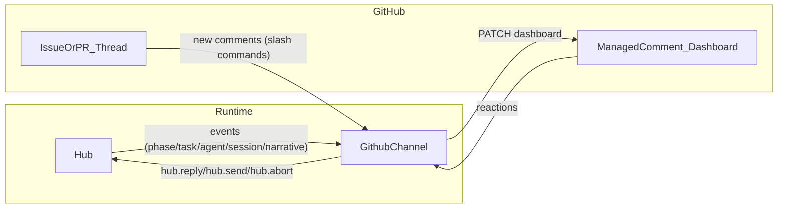

# GitHub Channel (packages/github-channel) — Implementation Plan

## Scope and locked decisions

- **Package**: implement a new standalone package under [`packages/github-channel`](packages/github-channel).
- **Output**: a single **bot-owned managed comment** (never edit issue/PR body) containing a sentinel block, patched in place.
- **Input**: **hybrid polling** of GitHub for new comments/reactions:
  - poll fast when a `session:prompt` is open
  - poll slow/minimal otherwise
- **Live test**: **required and human-operated**, runnable locally or via a manual GitHub Actions workflow.

Canonical docs we will keep code-aligned to:

- Spec: [`packages/github-channel/spec/github-channel.md`](packages/github-channel/spec/github-channel.md)
- Architecture: [`packages/github-channel/spec/github-channel-architecture.md`](packages/github-channel/spec/github-channel-architecture.md)
- Manifest: [`packages/github-channel/spec/github-channel-implementation-manifest.md`](packages/github-channel/spec/github-channel-implementation-manifest.md)
- Kernel contract reference: [`packages/kernel/docs/spec/channel.md`](packages/kernel/docs/spec/channel.md)

## Architecture (data flow)

## Implementation steps

### 1) Spec lock + decision records

- Add a small decisions/ADR section under `packages/github-channel/spec/decisions/` (mirroring kernel’s `docs/decisions/`) capturing:
  - managed-comment-only (no body edits)
  - hybrid polling strategy
  - required human-operated live test
- Update [`packages/github-channel/spec/github-channel.md`](packages/github-channel/spec/github-channel.md) to reference these ADRs (no ambiguity about what is locked).

### 2) Scaffold the new package

Create the missing package plumbing:

- `packages/github-channel/package.json` (bun scripts, strict TS, biome)
- `packages/github-channel/tsconfig.json` (extend repo base)
- `packages/github-channel/biome.jsonc` (match other packages)
- `packages/github-channel/src/index.ts` + `packages/github-channel/index.ts` export surface

### 3) Core library (pure pieces first)

Implement as small, testable modules:

- **Config**: zod schema + defaults (debounceMs/maxRecent/poll intervals)
- **State + reducer**: event → `GithubChannelState` (per spec)
- **Renderer**: state → markdown dashboard; `upsertSentinelBlock()`; stable output hashing
- **Parsers**:
  - slash command parser
  - reaction mapper

### 4) GitHub API client + writer

- Implement a thin GitHub REST client using `fetch` (no Octokit dependency) for:
  - list issue comments (supports `since`)
  - create comment
  - patch comment body
  - list reactions for a comment
- Writer responsibilities:
  - create/find the managed comment
  - patch only the sentinel block
  - debounce + hash guard
  - retry/backoff on 5xx, stop on 401

### 5) Hybrid input poller (comments + reactions)

- Poll loop runs while hub is running:
  - **Fast poll** when there is at least one open prompt in state
  - **Slow poll** otherwise
- Dedupe by last-seen timestamps/IDs.
- Ignore bot/self comments.
- Map parsed inputs to hub commands:
  - `/reply` + `/choose` → `hub.reply(...)` (unblocks `session.waitForUser(...)` in kernel harness)
  - `/abort` → `hub.abort(...)`
  - `/pause`/`/resume`/`/retry` → `hub.send(...)` messages (semantics are workflow-defined)

### 6) Tests

- **Unit tests** (`bun test`): reducer, renderer, command parser, reaction mapper.
- **Integration (offline)**: run a kernel harness using `defineHarness` from [`packages/kernel/src/engine/harness.ts`](packages/kernel/src/engine/harness.ts) with:
  - scripted phase/task/agent/narrative events
  - at least one `session.waitForUser(...)` prompt
  - a fake GitHub client capturing “writes” and providing synthetic “incoming comments/reactions”
  - assertions for debounce/idempotency, prompt lifecycle, recent window capping

### 7) Required live GitHub test (human-operated)

Deliver two equivalent ways to run the required live test:

- **Local**: a `bun` script in `packages/github-channel/scripts/live/` that:
  - runs a small `defineHarness(...)` demo
  - attaches `createGithubChannel(...)`
  - blocks on `session.waitForUser(...)` until the human replies via GitHub
  - logs observed hub events and confirms dashboard updates
- **GitHub Actions**: a manual `workflow_dispatch` workflow under `.github/workflows/` that runs the same script.

Human runbook (explicit, required):

- Create a throwaway issue/PR in the target repo.
- Provide token in `tokenEnv` (issue/comment perms).
- Run the live script (locally or via manual workflow).
- Post commands/reactions listed in the spec.
- Verify dashboard updates + prompt unblocks.
- Save the log output (attach to PR / paste into a `LIVE_TEST.md`).
- Cleanup: delete the managed comment and optionally the throwaway issue.

## Definition of done

- Package builds with strict TS and passes Biome.
- Unit + offline integration tests pass with no network.
- Live test runbook executed by a human at least once, with a saved log, and cleanup completed.
- Docs remain consistent with code (spec/architecture/manifest updated if signatures change).