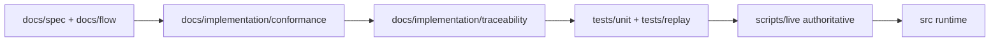

# Kernel: Docs → Conformance → Code (Plan)

## Scope (locked)

- **Strategy**: **A — Conformance-first, kernel-first vertical slices**
- **Docs location**: `packages/kernel/docs/implementation/`
- **Goal**: make it obvious how to “compile” the spec into code, with explicit gates that prevent gaps/spec-drift.

## Phase 1 — Add the missing “compiler driver” docs

### 1) Create implementation docs module

- Add an entrypoint: [`packages/kernel/docs/implementation/README.md`](packages/kernel/docs/implementation/README.md)
  - Links to roadmap + conformance + traceability
  - Defines the rule: **docs are canonical; code must conform**

### 2) Roadmap: milestone ordering + done criteria

- Add [`packages/kernel/docs/implementation/roadmap.md`](packages/kernel/docs/implementation/roadmap.md)
  - Milestone 0: conformance gates (no runtime yet)
  - Milestone 1: Hub minimal runtime (emit/subscribe/filter/envelope)
  - Milestone 2: Context propagation (`scoped/current` ALS semantics)
  - Milestone 3: Harness lifecycle + `phase/task` helpers + attachments
  - Milestone 4: Inbox routing + `runId` semantics
  - Milestone 5: Flow “Hello World” (YAML parse/validate/toposort/when/bindings) with built-in nodes
  - Milestone 6: Provider adapters behind **replay-first** infrastructure + explicit live scripts

Each milestone must define:

- **Inputs** (spec modules + test-spec requirements)
- **Outputs** (APIs + events)
- **Conformance gates** (unit/replay/live)
- **Authoritative script** (the “prove it works” command)

### 3) Conformance: what “done” means

- Add [`packages/kernel/docs/implementation/conformance.md`](packages/kernel/docs/implementation/conformance.md)
  - Defines test tiers:
    - **unit**: pure logic
    - **replay**: deterministic fixtures (no network, no writes)
    - **live**: explicit opt-in, authoritative scripts
  - Defines fixture policy:
    - `fixtures/scratch/` → review → promote → `fixtures/golden/`
    - no accidental recording
  - Defines **behavioral gates** (avoid the old failure modes):
    - default suite: no network, no fixture writes
    - timeouts and expected runtime
    - post-run repo cleanliness check
  - Defines command conventions (Bun-first) and script naming.

### 4) Traceability: eliminate gaps

- Add [`packages/kernel/docs/implementation/traceability.md`](packages/kernel/docs/implementation/traceability.md)
  - A matrix mapping:
    - spec modules (`docs/spec/*`, `docs/flow/*`, `docs/testing/*`)
    - → `tests/specs/*.test-spec.md` requirements (R1/R2/…)
    - → concrete tests (future `tests/unit|replay/*`)
    - → authoritative scripts (future `scripts/live/*`)
  - Explicitly marks what is **interface-contract-only today** vs **runtime behavior once implemented**.

### 5) Wire docs into the canonical entrypoint

- Update [`packages/kernel/docs/README.md`](packages/kernel/docs/README.md)
  - Add an **Implementation** section linking to `docs/implementation/README.md`
  - Clarify: “Spec → Conformance → Code” is the official workflow.

## Phase 2 — Compile docs into code: vertical slices (no provider complexity yet)

This phase begins only after Phase 1 docs are in place.

### Milestone 0 (Conformance scaffolding)

- Create the minimal **project-level test structure** in `packages/kernel/`:
  - `tests/unit/`, `tests/replay/`, `tests/fixtures/{golden,scratch}/`
  - `scripts/live/`
- Add minimal helper docs or a short `tests/README.md` if needed (optional; docs/testing already exists).
- Add package scripts that reflect the conformance doc:
  - `test:unit`, `test:replay`, `test` (safe default), `test:live` (explicit)

### Milestone 1 (Hub runtime)

- Implement a minimal Hub runtime that satisfies `tests/specs/hub.test-spec.md`
- Add:
  - unit tests for pure filter logic
  - replay tests using deterministic fixtures
  - authoritative script `scripts/live/hub-live.ts`

### Milestone 2–5

Proceed milestone-by-milestone from the roadmap, only advancing when conformance gates are green.

## Repo hygiene (important)

- Remove/avoid conflicting tooling (e.g. prefer `bun test` over adding a second test runner).
- Keep provider SDK dependencies out of default test paths.

## Deliverables at end of this plan

- Phase 1 docs fully written and linked from the canonical docs entrypoint.
- A concrete, dependency-ordered milestone plan that tells you what to implement next.
- A traceability matrix that prevents gaps.
- A conformance definition that prevents test drift and accidental fixture mutation.
