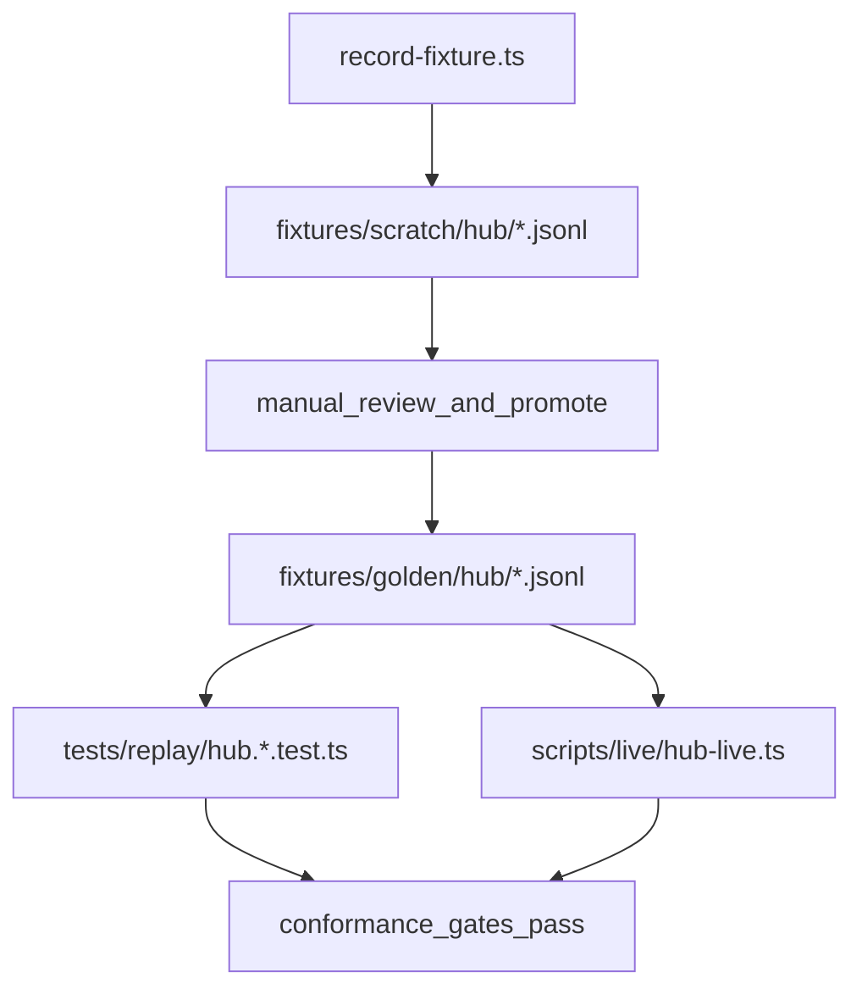

# Milestone 1–2: Hub conformance (fixtures + replay runner + live verification)

## Scope (validated against canonical docs)

**Canonical sources**:

- Milestone ordering + rule “don’t advance until gates pass”: [packages/kernel/docs/implementation/roadmap.md](packages/kernel/docs/implementation/roadmap.md)
- Fixture policy + behavioral gates: [packages/kernel/docs/implementation/conformance.md](packages/kernel/docs/implementation/conformance.md)
- Hub protocol semantics: [packages/kernel/docs/spec/hub.md](packages/kernel/docs/spec/hub.md)
- Hub requirements R1–R7 and required fixture names: [packages/kernel/tests/specs/hub.test-spec.md](packages/kernel/tests/specs/hub.test-spec.md)
- Testing protocol + JSONL fixture example: [packages/kernel/docs/testing/testing-protocol.md](packages/kernel/docs/testing/testing-protocol.md)

**Spec alignment check (important)**:

- `tests/specs/hub.test-spec.md` requires golden fixtures for **R1–R7**, and conformance requires fixtures exist and replay tests are fixture-driven.
- Today, `tests/fixtures/golden/` is empty and `scripts/record-fixture.ts` is missing, so Milestone 1–2 gates are not passable without implementing the fixture workflow.
- The example fixture schema in `docs/testing/testing-protocol.md` is “event list” oriented; to cover Hub **commands/status** requirements (R6/R7), the plan defines a fixture execution model that can represent both `emit(...)` and `send*`/status operations.

## Implementation plan

### 1) Make fixture schema capable of expressing all Hub requirements (R1–R7)

Update the canonical testing docs to remove ambiguity and ensure the fixture format can drive *all* Hub replay scenarios (including commands + status), while staying JSONL and scratch→golden.

Files:

- [packages/kernel/docs/testing/testing-protocol.md](packages/kernel/docs/testing/testing-protocol.md)
- [packages/kernel/docs/testing/workflow.md](packages/kernel/docs/testing/workflow.md)

What to document (minimal, Hub-focused):

- **Scenario record** remains one JSON object per line.
- Add a `steps` array that can represent:
  - `emit` steps (payload + optional context override)
  - `startSession` step
  - `send`, `sendTo`, `sendToRun`, `reply`, `abort` steps
  - `setStatus` step (for status tracking conformance)
- Add an `expect` section describing what’s asserted deterministically:
  - **Event sequence**: compare `event` payload and relevant `context` fields (ignore `id`/`timestamp` values)
  - **Envelope invariants**: separately assert `id` exists and `timestamp` is a `Date`
  - **Status/sessionActive expectations**: snapshot expected values after relevant steps

This keeps fixtures replayable and deterministic, matching the conformance requirements.

### 2) Implement fixture loader + runner used by both replay tests and recorder

Create a tiny testing helper layer:

- `packages/kernel/tests/helpers/fixture-loader.ts`
  - Load JSONL from `packages/kernel/tests/fixtures/golden/**` (and optionally `scratch/**` for local recording workflows).
  - Return typed scenario objects.
- `packages/kernel/tests/helpers/hub-fixture-runner.ts`
  - Execute `steps` against a real `Hub` instance created via `createHub(...)`.
  - Collect observed `EnrichedEvent`s by subscribing to `"*"`.
  - Return:
    - observed events (normalized for deterministic comparison)
    - observed status/sessionActive snapshots (if included in the fixture)

### 3) Implement `record-fixture` script (scratch-only)

Add:

- `packages/kernel/scripts/record-fixture.ts`

Behavior (per conformance docs):

- CLI: `bun scripts/record-fixture.ts <component> <fixture-name>`
- Writes only to: `packages/kernel/tests/fixtures/scratch/<component>/<fixture-name>.jsonl`
- Uses the same `hub-fixture-runner` (or equivalent shared runner) to:
  - execute the scenario steps
  - capture the observed events/status snapshots
  - emit a JSONL line matching the documented schema

### 4) Convert existing Hub replay tests to be fixture-driven

Update these tests to:

- load the correct fixture
- run the scenario via the shared runner
- assert observed output matches fixture expectations
- keep any “type narrowing” assertions (like current safe casts), but base the event sequence on fixture data

Files:

- [packages/kernel/tests/replay/hub.subscribe.test.ts](packages/kernel/tests/replay/hub.subscribe.test.ts)
- [packages/kernel/tests/replay/hub.scoped.test.ts](packages/kernel/tests/replay/hub.scoped.test.ts)
- [packages/kernel/tests/replay/hub.iteration.test.ts](packages/kernel/tests/replay/hub.iteration.test.ts)
- [packages/kernel/tests/replay/hub.commands.test.ts](packages/kernel/tests/replay/hub.commands.test.ts)
- [packages/kernel/tests/replay/hub.status.test.ts](packages/kernel/tests/replay/hub.status.test.ts)

Also ensure fixture paths match repo reality (`tests/fixtures/...`) and update the Hub test spec if it uses inconsistent paths.

### 5) Make the Hub live script authoritative by running the same fixtures

Update:

- [packages/kernel/scripts/live/hub-live.ts](packages/kernel/scripts/live/hub-live.ts)

So it:

- enumerates all Hub fixtures (R1–R7)
- runs the same runner logic against the real implementation
- reports pass/fail per scenario

This satisfies the roadmap’s “runs all replay scenarios” requirement.

### 6) Record and promote golden fixtures for Hub R1–R7

Commands (per docs):

- `bun scripts/record-fixture.ts hub subscribe-basic`
- `bun scripts/record-fixture.ts hub subscribe-filter`
- `bun scripts/record-fixture.ts hub scoped-context`
- `bun scripts/record-fixture.ts hub unsubscribe`
- `bun scripts/record-fixture.ts hub async-iteration`
- `bun scripts/record-fixture.ts hub commands`
- `bun scripts/record-fixture.ts hub status`

Workflow:

- Inspect scratch fixtures for correctness.
- Promote to:
  - `packages/kernel/tests/fixtures/golden/hub/*.jsonl`

### 7) Conformance gates: verify Milestone 1–2 are actually “passed”

Run the canonical validations from conformance docs:

- **Safe suite**: `bun test` (must only run unit + replay)
- **Replay suite**: `bun test tests/replay` must be fast and deterministic
- **No writes**: ensure `git status --porcelain` unchanged after replay tests
- **Authoritative script**: `bun scripts/live/hub-live.ts` passes

If any gate fails, fix until all pass, then mark Milestone 1–2 complete (and only then proceed to Milestone 3).

## Mermaid (data flow)

## Deliverables checklist (what “done” means)

- Golden fixtures exist for Hub R1–R7 under `packages/kernel/tests/fixtures/golden/hub/`.
- Replay tests load fixtures and do not define scenarios inline.
- Live script runs the same fixtures and passes.
- `bun test` is safe (unit + replay only), deterministic, and does not write fixtures.