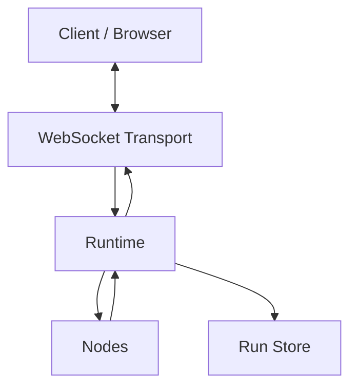
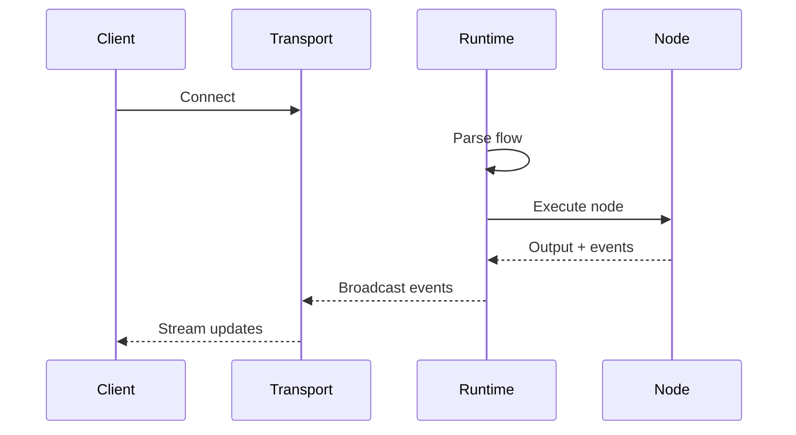

# Architecture

Open Harness is built around a simple event-driven architecture that separates
execution, integration, and external communication.

## Core Components

### Runtime

The **Runtime** is the execution engine. It:
- Parses flow definitions
- Resolves bindings and evaluates expressions
- Executes nodes in the correct order
- Emits events as the flow progresses
- Manages workflow state

### Nodes

**Nodes** are the building blocks that perform work. They can be:
- **LLM-backed** (like `claude.agent`) for reasoning and natural language
- **Deterministic** (like `echo`, `constant`) for transforms and validation

Every node implements the `NodeTypeDefinition` interface with a `run()` method.

### Transports

**Transports** connect the runtime to external clients. They:
- Broadcast runtime events to connected clients
- Receive commands (pause, resume, stop) from clients
- Examples: `WebSocketTransport` for browser clients

### Run Store

**Run stores** provide persistence for workflow state:
- `InMemoryRunStore` for development
- `SqliteRunStore` for production persistence

## System Diagram



## Execution Flow



## Entry Points

Open Harness provides three ways to run flows:

| Function | Use Case |
|----------|----------|
| `runFlow()` | Simple one-shot execution |
| `createHarness()` | Full control with transports |
| `createRuntime()` | Low-level runtime access |

### runFlow()

Simplest option - runs a flow and returns the result:

```typescript
import { runFlow, parseFlowYaml } from "@open-harness/server";

const snapshot = await runFlow({
  flow: parseFlowYaml(yaml),
  input: { name: "World" },
});
```

### createHarness()

Full control with transports and event handlers:

```typescript
import { createHarness, parseFlowYaml } from "@open-harness/server";

const harness = createHarness({
  flow: parseFlowYaml(yaml),
  transport: { websocket: { port: 8080 } },
  onEvent: (event) => console.log(event),
});

await harness.run({ name: "World" });
await harness.stop();
```

### createRuntime()

Low-level access to the runtime:

```typescript
import { createRuntime, parseFlowYaml } from "@open-harness/server";

const runtime = createRuntime({
  flow: parseFlowYaml(yaml),
  registry,
  store,
});

runtime.onEvent((event) => console.log(event));
const snapshot = await runtime.run({ name: "World" });
```

## Event System

The runtime emits events at each stage of execution:

| Event | When |
|-------|------|
| `flow:start` | Flow execution begins |
| `node:start` | Node execution begins |
| `agent:text` | Streaming text from LLM |
| `node:complete` | Node execution finishes |
| `flow:complete` | Flow execution finishes |

Subscribe to events with `runtime.onEvent()`:

```typescript
const unsubscribe = runtime.onEvent((event) => {
  if (event.type === "agent:text") {
    process.stdout.write(event.text);
  }
});
```

## Next Steps

- [Event System](/docs/concepts/event-system) — Deep dive on events
- [Expressions](/docs/concepts/expressions) — JSONata in bindings and conditions
- [Persistence](/docs/concepts/persistence) — Storing workflow state

