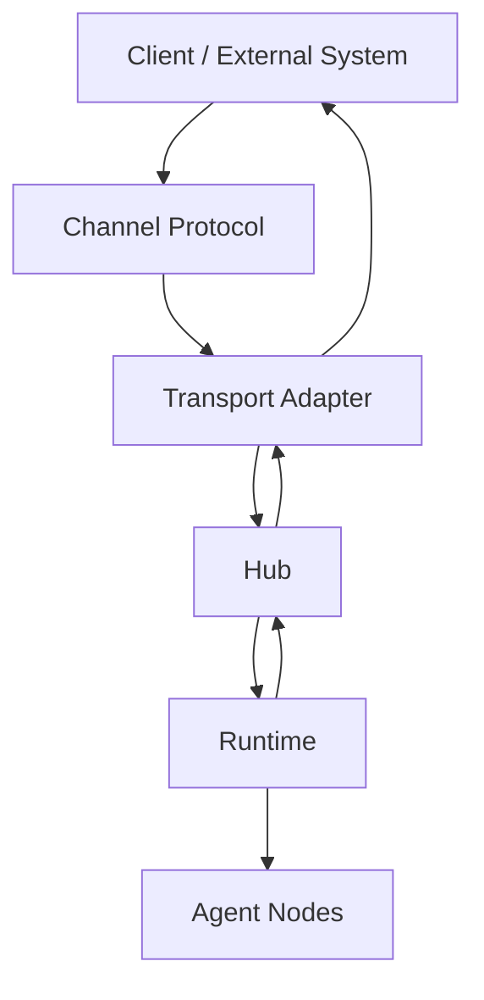
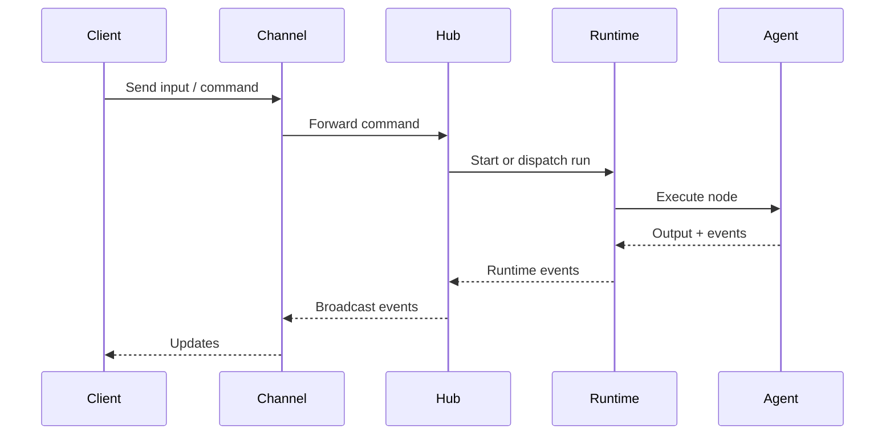

# Architecture

Open Harness is built around a simple event-driven architecture that separates
coordination, execution, and external integration.

## Core Components

### Hub

The Hub coordinates runs and broadcasts events. It is the central meeting point
for channels, runtimes, and external tooling.

### Runtime

The Runtime executes a flow: it resolves bindings, evaluates conditions, runs
nodes, and emits events as the flow progresses.

### Agents (Node Types)

Agents are node types that perform work. They can be LLM-backed (for reasoning
and natural language) or deterministic (for transforms, validation, routing).

### Channels

A **channel** is a protocol-level integration (e.g., WebSocket, HTTP, CLI). It
defines how commands enter the system and how events leave it.

### Transports (Adapters)

A **transport** is the concrete adapter that implements a channel for a
specific runtime or server environment.

## System Diagram

## Message Flow

## Channel vs Transport

- **Channel**: the protocol contract (what messages look like, how to route them).
- **Transport**: the implementation detail (WebSocket server, HTTP handler, CLI adapter).

## Next Steps

- [Event System](/docs/concepts/event-system) — How runtime events work
- [Expressions](/docs/concepts/expressions) — JSONata in bindings and conditions
