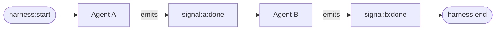
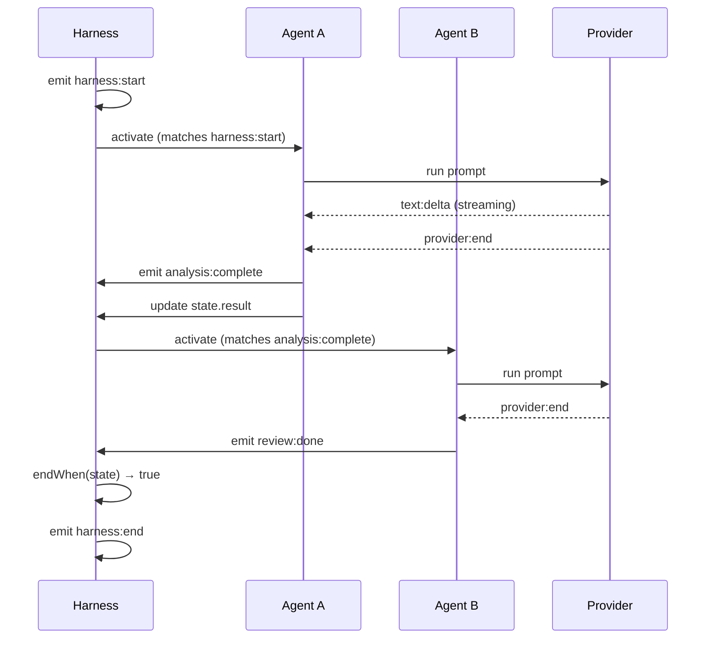

# Architecture

Open Harness v0.3.0 is built around a **signal-based reactive architecture**. Instead of explicitly defining edges between agents, agents declare what signals they react to and what signals they emit. Workflow emerges from signal flow.

## Core Principle

**State changes emit signals. Agents subscribe to signals. Workflow is emergent.**



## Core Components

### Signals

A **signal** is an immutable event that flows through the system:

```typescript
type Signal = {
  id: string;           // "sig_abc123"
  name: string;         // "analysis:complete"
  payload: unknown;     // The data
  timestamp: string;    // ISO timestamp
  source?: {
    agent?: string;     // Which agent emitted
    parent?: string;    // Causality chain
  };
};
```

**Signal Categories:**

| Category | Examples | Purpose |
|----------|----------|---------|
| Harness | `harness:start`, `harness:end` | Lifecycle events |
| Agent | `agent:activated`, `agent:skipped` | Agent execution |
| Provider | `provider:start`, `provider:end`, `text:delta` | LLM interaction |
| State | `state:analysis:changed` | State mutations |
| Custom | `analysis:complete`, `trade:proposed` | Your signals |

### Agents

An **agent** is a reactive unit that subscribes to signals and produces output:

```typescript
import { createHarness } from "@open-harness/core";

const { agent } = createHarness<MyState>();

const analyzer = agent({
  // The prompt template ({{ state.x }} syntax)
  prompt: "Analyze: {{ state.input }}",

  // What signals trigger this agent
  activateOn: ["harness:start"],

  // What signals this agent emits when done
  emits: ["analysis:complete"],

  // Optional guard - only activate if true
  when: (ctx) => ctx.state.input !== null,

  // Automatically update state with output
  updates: "result",
});
```

### Harness

A **harness** coordinates multiple agents and manages state:

```typescript
const { agent, runReactive } = createHarness<State>();

const result = await runReactive({
  agents: { analyzer, reviewer },
  state: initialState,
  provider: new ClaudeProvider(),
  endWhen: (state) => state.complete,
});
```

### Providers

**Providers** bridge AI SDKs to the signal architecture:

```typescript
import { ClaudeProvider } from "@open-harness/core";

const provider = new ClaudeProvider({
  model: "claude-sonnet-4-20250514",
});

// Provider emits signals during execution:
// provider:start → text:delta → text:delta → provider:end
```

## Signal Flow

Here's how signals flow through a typical workflow:



## Parallel Execution

When multiple agents subscribe to the same signal, they run **in parallel**:

```typescript
// Both react to harness:start → run concurrently
const riskAnalyzer = agent({
  activateOn: ["harness:start"],
  emits: ["risk:assessed"],
});

const costEstimator = agent({
  activateOn: ["harness:start"],
  emits: ["cost:estimated"],
});

// Both complete → downstream agents can react
const decider = agent({
  activateOn: ["risk:assessed", "cost:estimated"],
  // Activates when EITHER signal fires
});
```

## State Management

State updates emit signals automatically:

```typescript
type State = {
  analysis: string | null;
  trades: Trade[];
};

// When agent updates state.analysis:
// → emits state:analysis:changed

const trader = agent({
  activateOn: ["state:analysis:changed"],
  // Reacts to state changes
});
```

## Recording & Replay

The signal log **is** the recording:

```typescript
const result = await runReactive({
  // ... agents, state, provider ...
  recording: {
    mode: "record",
    store: new MemorySignalStore(),
    name: "my-workflow",
  },
});

// Result contains full signal trace
console.log(result.signals);
// [
//   { name: "harness:start", ... },
//   { name: "agent:activated", payload: { agent: "analyzer" } },
//   { name: "provider:start", ... },
//   { name: "text:delta", payload: { content: "The " } },
//   ...
// ]
```

Replay without provider calls:

```typescript
const result = await runReactive({
  // ... same config ...
  recording: {
    mode: "replay",
    store,
    recordingId: "rec_abc123",
  },
});
// Provider signals injected from recording
```

## API Summary

| Function | Purpose |
|----------|---------|
| `createHarness<TState>()` | Factory that returns typed `agent()` and `runReactive()` |
| `agent(config)` | Define a reactive agent |
| `runReactive(config)` | Execute the workflow |
| `ClaudeProvider` | Claude model adapter |
| `MemorySignalStore` | In-memory signal storage |
| `Player` | VCR-style debugging for recordings |

## Result Shape

All executions return:

```typescript
interface HarnessResult<TState> {
  state: TState;                    // Final state
  signals: Signal[];                // Full signal trace
  metrics: {
    durationMs: number;             // Total execution time
    activations: number;            // Number of agent activations
  };
  terminatedEarly: boolean;         // endWhen triggered
  recordingId?: string;             // If recording
}
```

## Next Steps

<Cards>
  <Card title="Multi-Agent Workflows" href="/docs/learn/multi-agent-flow">
    Chain agents with signal subscriptions
  </Card>
  <Card title="Recording & Replay" href="/docs/learn/persistence">
    Test with recorded signals
  </Card>
  <Card title="API Reference" href="/docs/reference">
    Full API documentation
  </Card>
</Cards>
