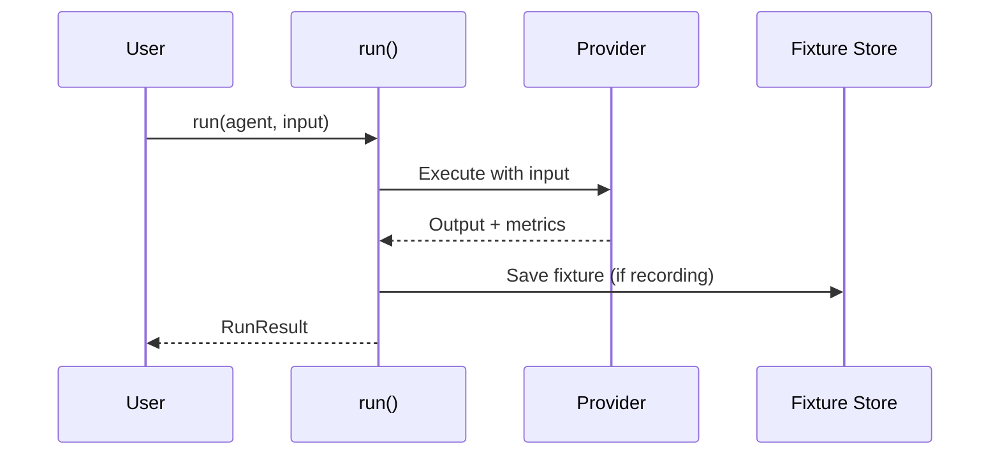

# Architecture

Open Harness is built around a simple agent-first architecture that separates
definition, execution, and evaluation.

## Core Components

### Agents

An **agent** is the fundamental building block. It encapsulates:
- A system prompt that defines behavior
- Input/output types
- Provider configuration (optional)

```typescript
import { agent } from "@open-harness/core";

const reviewer = agent({
  prompt: "Review code for bugs and security issues.",
});
```

### Harnesses

A **harness** coordinates multiple agents. It:
- Groups related agents together
- Defines how agents interact
- Manages shared state across agents

```typescript
import { harness, agent } from "@open-harness/core";

const classifier = agent({ prompt: "Classify the input type." });
const responder = agent({ prompt: "Generate a response." });

const myHarness = harness({
  agents: { classifier, responder },
  flow: async (agents, input) => {
    const type = await agents.classifier.run(input);
    return agents.responder.run({ ...input, type });
  },
});
```

### Providers

**Providers** are the execution backends that run agents. They:
- Connect to LLM APIs (Claude, etc.)
- Handle streaming responses
- Report metrics (latency, cost, tokens)

```typescript
import { setDefaultProvider } from "@open-harness/core";
import { createClaudeNode } from "@open-harness/server";

setDefaultProvider(createClaudeNode());
```

### Fixture Stores

**Fixture stores** enable recording and replay:
- Record live responses for deterministic testing
- Replay fixtures in CI without API calls
- Support regression detection

```typescript
import { FileFixtureStore } from "@open-harness/stores";

const store = new FileFixtureStore("./fixtures");
```

## System Diagram

```mermaid
flowchart TB
  agent[agent()]
  harness[harness()]
  run[run()]
  provider[Provider]
  store[Fixture Store]

  agent --> run
  harness --> run
  run --> provider
  run --> store
  provider --> result[RunResult]
  store --> result
```

## Execution Flow



## Entry Points

Open Harness provides a simple API:

| Function | Use Case |
|----------|----------|
| `agent()` | Define a single agent |
| `harness()` | Define a multi-agent workflow |
| `run()` | Execute an agent or harness |

### agent()

Define a single agent:

```typescript
import { agent } from "@open-harness/core";

const myAgent = agent({
  prompt: "You are a helpful assistant.",
});
```

### harness()

Coordinate multiple agents:

```typescript
import { harness, agent } from "@open-harness/core";

const myHarness = harness({
  agents: { agent1, agent2 },
  flow: async (agents, input) => {
    // Custom orchestration logic
  },
});
```

### run()

Execute an agent or harness:

```typescript
import { run } from "@open-harness/core";

const result = await run(myAgent, { prompt: "Hello" });
```

## Result Shape

All executions return a consistent shape:

```typescript
{
  output: T,                    // The agent's response
  state?: Record<string, unknown>,  // Optional state
  metrics: {
    latencyMs: number,          // Execution time
    cost: number,               // USD cost
    tokens: { input, output },  // Token usage
  },
  fixtures?: string[],          // Fixture IDs if recording
}
```

## Event System

The runtime emits events during execution:

| Event | When |
|-------|------|
| `agent:start` | Agent execution begins |
| `agent:text` | Streaming text from LLM |
| `agent:complete` | Agent execution finishes |
| `agent:error` | Error during execution |

Subscribe to events for monitoring:

```typescript
import { onEvent } from "@open-harness/core";

onEvent((event) => {
  if (event.type === "agent:text") {
    process.stdout.write(event.text);
  }
});
```

## Next Steps

- [Event System](/docs/concepts/event-system) — Deep dive on events
- [Expressions](/docs/concepts/expressions) — JSONata in bindings
- [Persistence](/docs/concepts/persistence) — Storing workflow state
