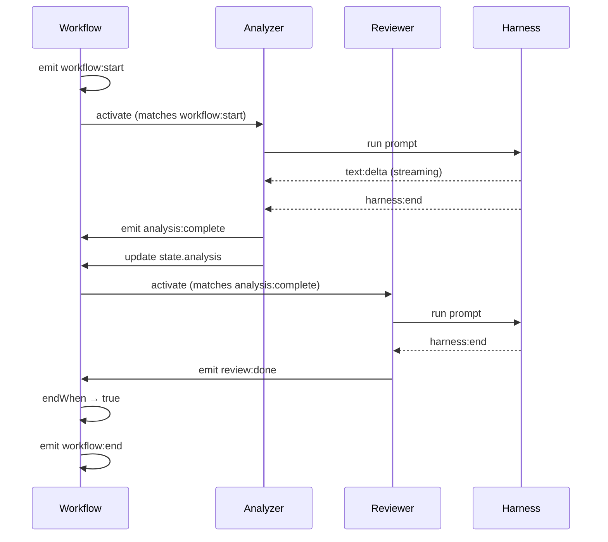

# Signal System

Everything in Open Harness communicates through signals.

## Core Principle

> Signals are the single source of truth for system state.

Instead of direct method calls, agents emit and subscribe to signals. This provides:

- **Observability**: See exactly what happened
- **Replay**: Reconstruct state from signals
- **Decoupling**: Agents don't know about each other
- **Testing**: Deterministic signal replay in CI

## Signal Structure

All signals share a common structure:

```typescript
interface Signal {
  id: string;           // Unique signal ID ("sig_abc123")
  name: string;         // Signal name ("analysis:complete")
  payload: unknown;     // Signal-specific data
  timestamp: string;    // ISO timestamp
  source?: {
    agent?: string;     // Which agent emitted this
    parent?: string;    // Parent signal (causality chain)
  };
}
```

## Signal Categories

### Workflow Lifecycle

```typescript
{ name: "workflow:start", payload: { state: {...} } }
{ name: "workflow:end", payload: { state: {...}, metrics: {...} } }
```

### Agent Signals

```typescript
{ name: "agent:activated", payload: { agent: "analyzer" } }
{ name: "agent:skipped", payload: { agent: "reviewer", reason: "when guard false" } }
{ name: "agent:completed", payload: { agent: "analyzer", output: "..." } }
```

### Harness Signals

```typescript
{ name: "harness:start", payload: { model: "claude-sonnet-4-20250514" } }
{ name: "harness:end", payload: { usage: { inputTokens: 100, outputTokens: 50 } } }
{ name: "harness:error", payload: { error: "Rate limited" } }
```

### Text Streaming

```typescript
{ name: "text:delta", payload: { content: "The " } }
{ name: "text:delta", payload: { content: "analysis " } }
{ name: "text:complete", payload: { content: "The analysis shows..." } }
```

### Thinking (Extended Thinking)

```typescript
{ name: "thinking:delta", payload: { content: "Let me consider..." } }
{ name: "thinking:complete", payload: { content: "..." } }
```

### Tool Usage

```typescript
{ name: "tool:call", payload: { name: "Read", input: { path: "/file.ts" } } }
{ name: "tool:result", payload: { name: "Read", output: "file contents..." } }
```

### State Changes

```typescript
{ name: "state:analysis:changed", payload: { value: "new analysis" } }
{ name: "state:score:changed", payload: { value: 0.95 } }
```

### Custom Signals

Agents can emit custom signals via `emits`:

```typescript
const analyzer = agent({
  prompt: "Analyze the input",
  activateOn: ["workflow:start"],
  emits: ["analysis:complete"],  // Custom signal
});
```

## Subscribing to Signals

Agents subscribe to signals with `activateOn`:

```typescript
// Activate on workflow lifecycle
activateOn: ["workflow:start"]

// Activate on custom signals
activateOn: ["analysis:complete", "review:done"]

// Activate on harness events
activateOn: ["harness:end"]

// Activate on state changes
activateOn: ["state:analysis:changed"]
```

## Pattern Matching

Signal patterns support wildcards:

```typescript
// Single segment wildcard
"agent:*"  // Matches agent:activated, agent:completed, etc.

// Multi-segment wildcard
"harness:**"  // Matches harness:start, harness:end, harness:error

// Prefix matching
"*:complete"  // Matches analysis:complete, review:complete, etc.
```

## Signal Flow Example



## Causality Tracking

Signals include source tracking for debugging:

```typescript
const signals = result.signals;

// Find what triggered the reviewer
const reviewerActivation = signals.find(
  s => s.name === "agent:activated" && s.payload.agent === "reviewer"
);
console.log("Triggered by:", reviewerActivation.source.parent);
```

## Signal Trace

Every `runReactive` returns the full signal trace:

```typescript
const result = await runReactive({ /* ... */ });

console.log(result.signals);
// [
//   { name: "workflow:start", ... },
//   { name: "agent:activated", payload: { agent: "analyzer" } },
//   { name: "harness:start", ... },
//   { name: "text:delta", ... },
//   { name: "harness:end", ... },
//   { name: "analysis:complete", ... },
//   { name: "workflow:end", ... },
// ]
```

## Next Steps

<Cards>
  <Card title="Architecture" href="/docs/concepts/architecture">
    Full signal architecture overview
  </Card>
  <Card title="Recording & Replay" href="/docs/learn/persistence">
    Persist and replay signals
  </Card>
  <Card title="API Reference" href="/docs/reference">
    Signal API documentation
  </Card>
</Cards>
