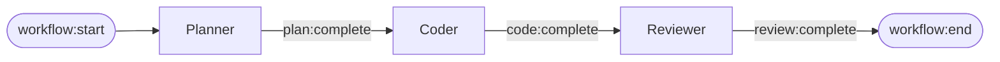
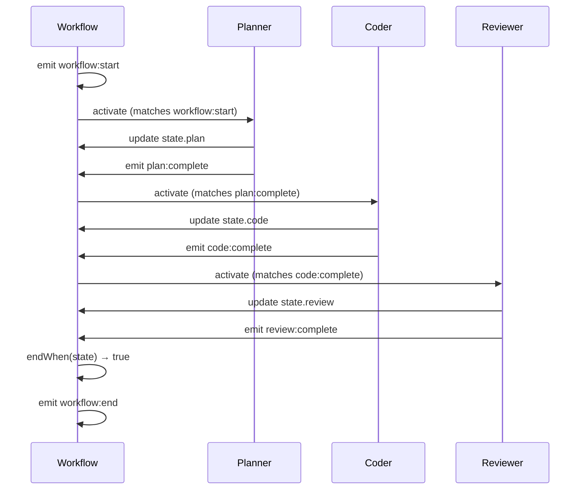

# Multi-Agent Workflows

Build workflows where multiple agents collaborate through signal-based coordination.

## What You'll Build

A code review pipeline where agents communicate through signals:



## Define the Agents

```typescript
import { createWorkflow, ClaudeHarness } from "@open-harness/core";

type State = {
  task: string;
  plan: string | null;
  code: string | null;
  review: { passed: boolean; feedback: string } | null;
};

const { agent, runReactive } = createWorkflow<State>();

// Planner: Reacts to workflow:start
const planner = agent({
  prompt: `Create an implementation plan for: {{ state.task }}`,
  activateOn: ["workflow:start"],
  emits: ["plan:complete"],
  updates: "plan",
});

// Coder: Reacts to planner's signal
const coder = agent({
  prompt: `Implement this plan:
{{ state.plan }}`,
  activateOn: ["plan:complete"],
  emits: ["code:complete"],
  updates: "code",
});

// Reviewer: Reacts to coder's signal
const reviewer = agent({
  prompt: `Review this code:
{{ state.code }}

Respond with JSON: { "passed": boolean, "feedback": string }`,
  activateOn: ["code:complete"],
  emits: ["review:complete"],
  updates: "review",
});
```

## Run the Workflow

```typescript
const result = await runReactive({
  agents: { planner, coder, reviewer },
  state: {
    task: "Create a function to validate email addresses",
    plan: null,
    code: null,
    review: null,
  },
  harness: new ClaudeHarness(),
  endWhen: (s) => s.review !== null,
});

console.log("Plan:", result.state.plan);
console.log("Code:", result.state.code);
console.log("Review passed:", result.state.review?.passed);
```

## Signal Flow

Here's how signals coordinate the agents:



## Parallel Agents

When multiple agents subscribe to the same signal, they run **in parallel**:

```typescript
// Both react to workflow:start → run concurrently
const riskAnalyzer = agent({
  prompt: "Analyze risk for: {{ state.proposal }}",
  activateOn: ["workflow:start"],
  emits: ["risk:assessed"],
  updates: "riskScore",
});

const costEstimator = agent({
  prompt: "Estimate cost for: {{ state.proposal }}",
  activateOn: ["workflow:start"],
  emits: ["cost:estimated"],
  updates: "costEstimate",
});

// Decider waits for both to complete
const decider = agent({
  prompt: `Risk: {{ state.riskScore }}
Cost: {{ state.costEstimate }}
Make a decision.`,
  activateOn: ["risk:assessed", "cost:estimated"],
  when: (ctx) => ctx.state.riskScore !== null && ctx.state.costEstimate !== null,
  emits: ["decision:made"],
});
```

## Conditional Activation

Use `when` guards to conditionally activate agents:

```typescript
const escalationAgent = agent({
  prompt: "Escalate this high-priority issue: {{ state.issue }}",
  activateOn: ["issue:created"],
  when: (ctx) => ctx.state.priority === "high",
  emits: ["escalation:sent"],
});
```

## Key Concepts

### Signal Subscription

Agents declare what signals they react to with `activateOn`:

```typescript
activateOn: ["workflow:start"]     // React to workflow lifecycle
activateOn: ["plan:complete"]      // React to custom signals
activateOn: ["state:code:changed"] // React to state changes
```

### Signal Emission

Agents declare what signals they emit with `emits`:

```typescript
emits: ["plan:complete"]  // Other agents can subscribe to this
```

### State Updates

The `updates` field automatically writes agent output to state:

```typescript
updates: "plan"  // Agent output → state.plan
```

## Next Steps

<Cards>
  <Card title="Recording & Replay" href="/docs/learn/persistence">
    Test multi-agent workflows with recorded signals
  </Card>
  <Card title="Architecture" href="/docs/concepts/architecture">
    Deep dive into signal-based orchestration
  </Card>
  <Card title="API Reference" href="/docs/reference">
    Full API documentation
  </Card>
</Cards>
