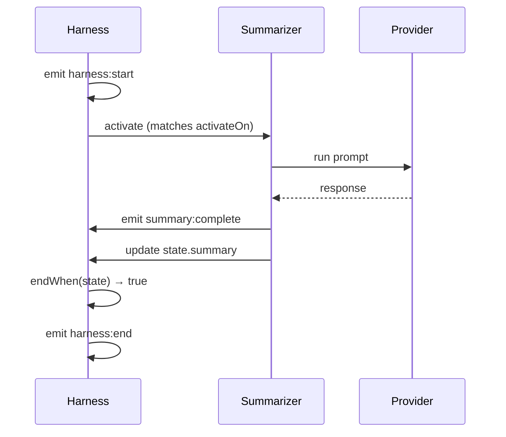

# Quickstart

This guide will get you running a reactive agent in under 5 minutes.

## Prerequisites

- [Bun](https://bun.sh) installed
- Claude Code subscription (for auth) or Anthropic API key

## Installation

Create a new project and install Open Harness:

```bash
mkdir my-agent && cd my-agent
bun init -y
bun add @open-harness/core
```

## Your First Agent

Create `index.ts`:

```typescript
import { createHarness, ClaudeProvider } from "@open-harness/core";

// 1. Define your state type
type State = {
  topic: string;
  summary: string | null;
};

// 2. Create a typed harness factory
const { agent, runReactive } = createHarness<State>();

// 3. Define a reactive agent
const summarizer = agent({
  prompt: `Summarize this topic in 2-3 sentences: {{ state.topic }}`,
  activateOn: ["harness:start"],
  emits: ["summary:complete"],
  updates: "summary",
});

// 4. Run the workflow
async function main() {
  const provider = new ClaudeProvider({
    model: "claude-sonnet-4-20250514",
  });

  const result = await runReactive({
    agents: { summarizer },
    state: {
      topic: "The history of artificial intelligence",
      summary: null,
    },
    provider,
    endWhen: (s) => s.summary !== null,
  });

  console.log("Summary:", result.state.summary);
  console.log("Duration:", result.metrics.durationMs, "ms");
}

main();
```

## Run It

```bash
bun run index.ts
```

You should see output like:

```
Summary: Artificial intelligence research began in the 1950s with pioneers like Alan Turing...
Duration: 1234 ms
```

## What Just Happened?

Let's break down the signal flow:



1. **`harness:start`** - The harness emits a start signal
2. **Agent activates** - Summarizer subscribes to `harness:start`
3. **Provider runs** - Claude generates the summary
4. **State updates** - `updates: "summary"` writes the output to state
5. **Workflow ends** - `endWhen` condition is satisfied

## Key Concepts

### Signal Subscription

Agents declare what signals they react to:

```typescript
activateOn: ["harness:start"]  // React to harness lifecycle
activateOn: ["analysis:done"]  // React to custom signals
```

### State Updates

The `updates` field automatically writes agent output to state:

```typescript
updates: "summary"  // output → state.summary
```

### Termination

`endWhen` defines when the workflow completes:

```typescript
endWhen: (state) => state.summary !== null
```

<Callout type="stuck" title="Are you stuck?">
**Error: Cannot find module '@open-harness/core'**
Run `bun install` to install dependencies.

**Error: Authentication failed**
Make sure you're running from within Claude Code, or set the `ANTHROPIC_API_KEY` environment variable.
</Callout>

## Next Steps

<Cards>
  <Card title="Multi-Agent Workflows" href="/docs/learn/multi-agent-flow">
    Chain multiple agents together
  </Card>
  <Card title="Signal Patterns" href="/docs/concepts/architecture">
    Learn the signal system in depth
  </Card>
  <Card title="Recording & Replay" href="/docs/learn/persistence">
    Test agents with recorded signals
  </Card>
</Cards>
