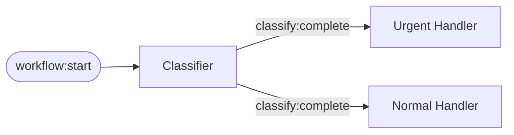
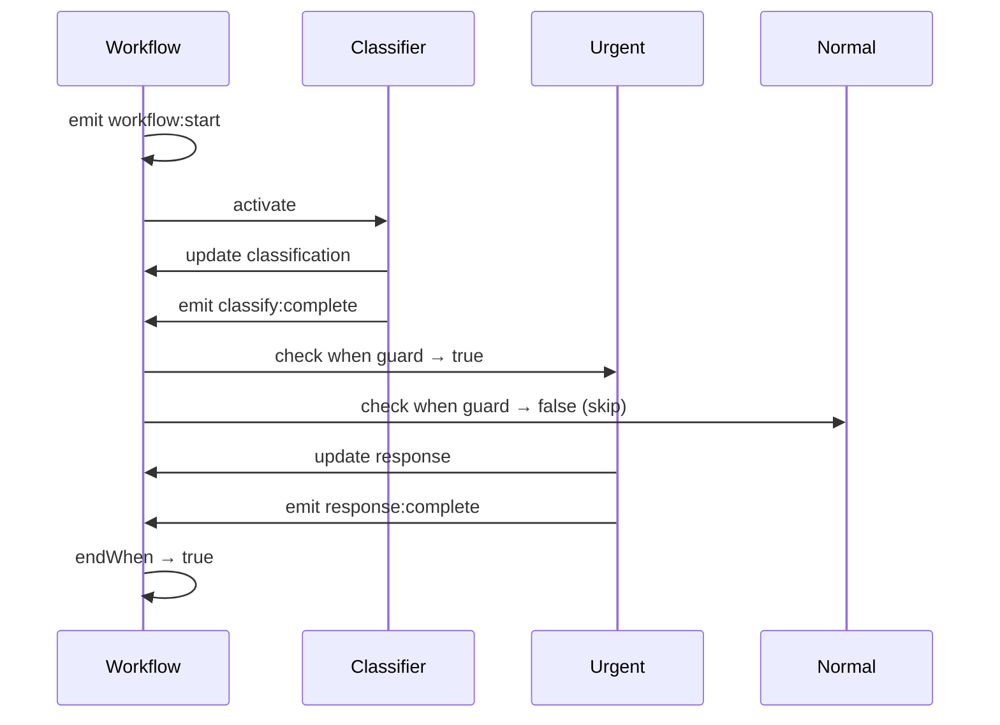

# Your First Agent

Build a task classifier that routes work based on priority using reactive signals.

## What You'll Build

An agent that:
- Classifies incoming tasks as `urgent` or `normal`
- Routes to different handlers based on classification
- Demonstrates conditional activation with `when` guards



## Step 1: Define State and Agents

```typescript
import { createWorkflow, ClaudeHarness } from "@open-harness/core";

// Define your state type
type State = {
  task: string;
  classification: { priority: "urgent" | "normal"; reason: string } | null;
  response: string | null;
};

// Create typed workflow factory
const { agent, runReactive } = createWorkflow<State>();

// Classifier agent: determines priority
const classifier = agent({
  prompt: `Classify this task as "urgent" or "normal":
{{ state.task }}

Respond with JSON: { "priority": "urgent" | "normal", "reason": string }`,
  activateOn: ["workflow:start"],
  emits: ["classify:complete"],
  updates: "classification",
});

// Urgent handler: only activates for urgent tasks
const urgentHandler = agent({
  prompt: `Handle this URGENT task immediately:
{{ state.task }}
Reason for urgency: {{ state.classification.reason }}`,
  activateOn: ["classify:complete"],
  when: (ctx) => ctx.state.classification?.priority === "urgent",
  emits: ["response:complete"],
  updates: "response",
});

// Normal handler: only activates for normal tasks
const normalHandler = agent({
  prompt: `Process this normal priority task:
{{ state.task }}`,
  activateOn: ["classify:complete"],
  when: (ctx) => ctx.state.classification?.priority === "normal",
  emits: ["response:complete"],
  updates: "response",
});
```

## Step 2: Run the Workflow

```typescript
async function main() {
  const harness = new ClaudeHarness({
    model: "claude-sonnet-4-20250514",
  });

  const result = await runReactive({
    agents: { classifier, urgentHandler, normalHandler },
    state: {
      task: "ASAP: Reset production password for admin user",
      classification: null,
      response: null,
    },
    harness,
    endWhen: (s) => s.response !== null,
  });

  console.log("Classification:", result.state.classification);
  console.log("Response:", result.state.response);
  console.log("Duration:", result.metrics.durationMs, "ms");
}

main();
```

Run it:

```bash
bun run index.ts
```

Expected output:

```
Classification: { priority: "urgent", reason: "Password reset for production admin..." }
Response: "Immediately initiating password reset protocol..."
Duration: 2345 ms
```

## How It Works

1. **workflow:start** triggers the classifier
2. Classifier emits **classify:complete** with the classification
3. Both handlers receive **classify:complete**, but only one passes its `when` guard
4. The matching handler runs and emits **response:complete**
5. **endWhen** condition is satisfied, workflow ends



## Key Concepts

### Conditional Activation with `when`

The `when` guard runs before agent activation:

```typescript
when: (ctx) => ctx.state.classification?.priority === "urgent"
```

- Returns `true`: agent activates
- Returns `false`: agent is skipped

### Template Expressions

Access state in prompts with `{{ state.x }}` syntax:

```typescript
prompt: `Task: {{ state.task }}
Reason: {{ state.classification.reason }}`
```

### Automatic State Updates

The `updates` field maps agent output to state:

```typescript
updates: "classification"  // Agent output → state.classification
```

<Callout type="stuck" title="Are you stuck?">
**Both handlers run**
Check your `when` guards — they should be mutually exclusive (one checks `=== "urgent"`, the other `=== "normal"`).

**Error: Cannot read property 'priority' of null**
Use optional chaining: `ctx.state.classification?.priority === "urgent"`
</Callout>

## Next Steps

<Cards>
  <Card title="Multi-Agent Workflows" href="/docs/learn/multi-agent-flow">
    Chain multiple agents with signal subscriptions
  </Card>
  <Card title="Recording & Replay" href="/docs/learn/persistence">
    Test agents with recorded signals
  </Card>
  <Card title="Architecture" href="/docs/concepts/architecture">
    Learn the signal system in depth
  </Card>
</Cards>
