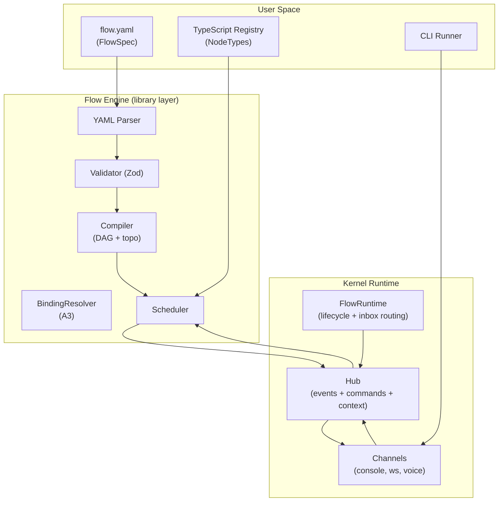

> **Generated page.** Edit the source at `packages/kernel/docs/README.md`.

This is the **canonical specification** for the unified kernel + flow system.

## Purpose

This spec defines:
- **Kernel protocol**: the minimal runtime substrate (Hub, FlowRuntime, Agent, Channel)
- **Flow protocol**: declarative YAML DAG execution layer built on the kernel

The kernel provides the event bus, lifecycle management, and bidirectional communication primitives. The flow layer provides structured orchestration (DAG scheduling, conditional execution, bindings) that runs *inside the Flow runtime*.

## Canonical naming

Use these terms consistently everywhere:

### Kernel primitives

- **Hub**: unified bidirectional bus
  - Events out: `subscribe(...)`, async iteration
  - Commands in: `send/sendTo/sendToRun/reply/abort`
  - Context propagation: `scoped(...)`, `current()`
- **FlowRuntime**: orchestrator that owns lifecycle, phase/task helpers, and inbox routing
- **Agent**: executable unit (`AgentDefinition.execute(...)`) that emits `agent:*` events and returns a result
- **Channel**: bidirectional adapter/attachment (console/websocket/voice/etc.) that observes events and sends commands

### Flow layer

- **FlowSpec**: YAML definition of a DAG (`flow`, `nodes`, `edges`)
- **FlowRun**: one execution of a FlowSpec
- **NodeSpec**: one node instance in the graph (`id`, `type`, `input`, `when`, `policy`, `config`)
- **NodeType**: the TypeScript implementation registered under `node.type`

## Architecture overview

**Key invariant**: Flow is the only runtime. There is no legacy runtime layer.

## Spec modules

### Kernel protocol

- [Events](spec/events.mdx) - Event envelope, required event types, context rules
- [Hub](spec/hub.mdx) - Hub API (events out + commands in) + semantics
- [Flow Runtime](spec/flow-runtime.mdx) - Lifecycle + phases/tasks + session semantics
- [Agent](spec/agent.mdx) - AgentDefinition contract, runId/inbox injection semantics
- [Channel](spec/channel.mdx) - Channel contract + recommended patterns

### Flow protocol

- [FlowSpec](flow/flow-spec.mdx) - FlowSpec YAML schema + semantics (edges/when/policy)
- [Bindings](flow/bindings.mdx) - A3 binding grammar + errors
- [When](flow/when.mdx) - WhenExpr grammar + evaluation semantics
- [Execution](flow/execution.mdx) - Flow runtime execution semantics
- [Registry](flow/registry.mdx) - NodeType contract (schemas/capabilities) + library-vs-user responsibilities
- [Edge Routing](flow/edge-routing.mdx) - Edge-level `when` semantics
- [Node Catalog](flow/node-catalog.mdx) - Canonical node list

### Reference

- [Protocol Types](reference/protocol-types.mdx) - Authoritative TypeScript interfaces

### Testing

- [Testing Overview](testing/index.mdx) - Testing infrastructure overview and navigation
- [Testing Protocol](testing/testing-protocol.mdx) - Testing infrastructure protocol spec
- [Test Spec Template](testing/test-spec-template.mdx) - Template for all `.test-spec.md` files
- [Validation Guide](testing/validation.mdx) - Multi-layer validation strategy and checklists
- [Workflow Guide](testing/workflow.mdx) - Step-by-step testing workflow

### Implementation

- [Implementation Overview](implementation/index.mdx) - How to compile spec into code
- [Roadmap](implementation/roadmap.mdx) - Milestone ordering + done criteria + authoritative scripts
- [Conformance](implementation/conformance.mdx) - Test tiers, fixture policy, behavioral gates
- [Traceability](implementation/traceability.mdx) - Spec → test-spec → tests → live scripts mapping

**Workflow**: Spec → Conformance → Code

### Decisions

- [0001-naming-flow-vs-workflow](decisions/0001-naming-flow-vs-workflow.mdx)
- [0002-edges-required](decisions/0002-edges-required.mdx)
- [0003-bindings-a3](decisions/0003-bindings-a3.mdx)
