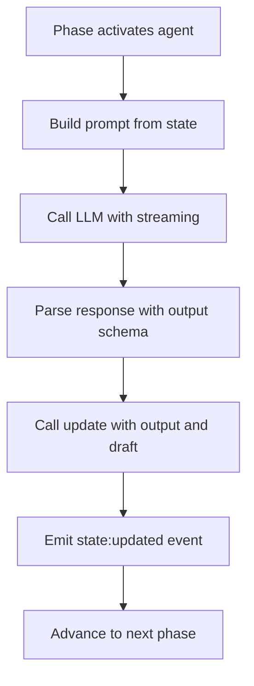

# Agents

**Pure functions that transform state through AI.**

---

Agents are the AI actors in Open Harness. Each agent is a single LLM call with typed input and output—a pure function that reads state, calls a model, and returns structured data.

## Agents Are Functions

Think of an agent as a pure function:

```
Input (state) → LLM → Structured Output → State Update
```

Agents have no memory between invocations. They don't maintain conversation history or accumulated context. Each call is independent, receiving the current state and producing output.

```typescript
import { agent } from "@open-harness/core"
import { z } from "zod"

const planner = agent({
  name: "planner",
  model: "claude-sonnet-4-5",

  // Schema for structured output (required)
  output: z.object({
    tasks: z.array(z.string()),
    priority: z.enum(["low", "medium", "high"])
  }),

  // Generate prompt from current state
  prompt: (state) => `Create a plan for: ${state.goal}`,

  // Update state with agent output
  update: (output, draft) => {
    draft.tasks = output.tasks
    draft.priority = output.priority
  }
})
```

## The Agent Lifecycle

When an agent runs, it follows a predictable sequence:



Each step is observable through events, making debugging straightforward.

## Structured Output Is Required

Every agent must have an `output` schema. This isn't optional—it's fundamental to how Open Harness works.

```typescript
// Define exactly what the agent returns
output: z.object({
  analysis: z.string(),
  confidence: z.number().min(0).max(1),
  recommendations: z.array(z.object({
    action: z.string(),
    reason: z.string()
  }))
})
```

**Why require structured output?**

| Benefit | Explanation |
|---------|-------------|
| **Reliability** | LLM output is validated against the schema |
| **Type Safety** | `update` receives typed data, not raw strings |
| **Determinism** | Output maps cleanly to state updates |
| **Testability** | Known shapes make assertions straightforward |

No free-text parsing, no regex extraction, no hoping the model followed instructions. The LLM returns structured data matching your schema, or the call fails with a validation error.

## The Update Function

The `update` function receives the validated output and a draft of the current state. It uses [Immer](https://immerjs.github.io/immer/) semantics—mutate the draft directly:

```typescript
update: (output, draft) => {
  // Direct mutation is fine—Immer handles immutability
  draft.analysis = output.analysis
  draft.recommendations.push(...output.recommendations)
  draft.lastUpdated = Date.now()
}
```

The runtime:

1. Creates an Immer draft from current state
2. Calls your update function
3. Produces an immutable update
4. Emits a `state:updated` event with patches

## Provider Agnostic

Agents work with any AI provider. You specify the model, and the runtime handles provider-specific details:

```typescript
// Works with Anthropic
const agent1 = agent({
  model: "claude-sonnet-4-5",
  // ...
})

// Works with OpenAI
const agent2 = agent({
  model: "gpt-4o",
  // ...
})

// Works with any provider you configure
const agent3 = agent({
  model: "custom-model",
  // ...
})
```

Provider configuration happens at runtime, not in agent definitions. This keeps agents portable and testable.

## Prompt Engineering

The `prompt` function receives the current state and returns a string or messages array:

```typescript
// Simple string prompt
prompt: (state) => `Analyze this data: ${JSON.stringify(state.data)}`

// Complex prompt with system message
prompt: (state) => [
  { role: "system", content: "You are a data analyst." },
  { role: "user", content: `Analyze: ${state.data}` }
]
```

**Best practices:**

- Extract only what the agent needs from state
- Include examples for complex output schemas
- Be explicit about output format expectations

## Agent Options

Agents support additional configuration:

```typescript
const researcher = agent({
  name: "researcher",
  model: "claude-sonnet-4-5",
  output: researchSchema,
  prompt: (state) => `Research: ${state.topic}`,
  update: (output, draft) => { draft.findings = output.findings },

  // Optional configuration
  temperature: 0.7,           // Creativity (0-1)
  maxTokens: 4096,           // Response limit
  tools: [searchTool],       // Available tools
  thinking: true,            // Enable extended thinking
})
```

## Tools

Agents can use tools for external capabilities:

```typescript
import { tool } from "@open-harness/core"

const searchTool = tool({
  name: "search",
  description: "Search the web for information",
  parameters: z.object({
    query: z.string()
  }),
  execute: async ({ query }) => {
    // Perform search, return results
    return await searchWeb(query)
  }
})

const researcher = agent({
  name: "researcher",
  model: "claude-sonnet-4-5",
  output: z.object({ summary: z.string() }),
  prompt: (state) => `Research: ${state.topic}`,
  update: (output, draft) => { draft.summary = output.summary },
  tools: [searchTool]
})
```

Tool calls are recorded as events, making them reproducible in playback mode.

## Example: Multi-Step Agent

Here's a complete example of an agent that analyzes code:

```typescript
const codeAnalyzer = agent({
  name: "code-analyzer",
  model: "claude-sonnet-4-5",

  output: z.object({
    language: z.string(),
    complexity: z.enum(["simple", "moderate", "complex"]),
    issues: z.array(z.object({
      line: z.number(),
      severity: z.enum(["info", "warning", "error"]),
      message: z.string()
    })),
    suggestions: z.array(z.string())
  }),

  prompt: (state) => `
    Analyze this code for issues and suggestions:

    \`\`\`${state.language}
    ${state.code}
    \`\`\`

    Focus on:
    - Code quality issues
    - Potential bugs
    - Performance improvements
  `,

  update: (output, draft) => {
    draft.analysis = {
      language: output.language,
      complexity: output.complexity,
      issues: output.issues,
      suggestions: output.suggestions,
      analyzedAt: Date.now()
    }
  }
})
```

## Summary

| Aspect | Description |
|--------|-------------|
| **Pure Function** | No memory between calls, predictable behavior |
| **Structured Output** | Schema validation ensures type safety |
| **Immer Updates** | Mutate drafts directly, get immutable results |
| **Provider Agnostic** | Works with any AI provider |
| **Observable** | Every step emits events for debugging |

!!! tip "Design Principle"
    Keep agents focused on a single task. Complex behavior emerges from composing simple agents through phases, not from making individual agents more complex.

---

## Next

Learn how [Phases](phases.md) orchestrate agents into multi-step workflows.
