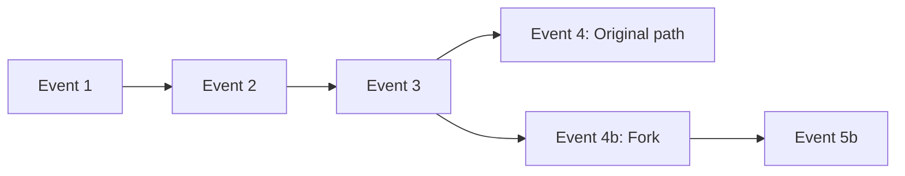

# Events

**Immutable facts that power time-travel debugging.**

---

Events are the foundation of Open Harness. Every action, state change, and AI response is recorded as an immutable event. This simple choice unlocks powerful capabilities.

## The VCR Tape Analogy

Think of your workflow as a **VCR tape**. Events are recorded as they happen. State is just "where we are on the tape."

```
TAPE (Events)
┌────┬────┬────┬────┬────┬────┬────┬────┐
│ E1 │ E2 │ E3 │ E4 │ E5 │ E6 │ E7 │ E8 │  ← Events (immutable)
└────┴────┴────┴────┴────┴────┴────┴────┘
                          ▲
                     current position
                          │
                     STATE (derived)
```

**State is derived from events.** You never store state directly. Instead, you replay events to reconstruct any point in history.

## Event Types

Events use past tense because they're **facts about what happened**, not commands:

```typescript
// Workflow lifecycle
"workflow:started"     // Workflow execution began
"workflow:completed"   // Workflow finished successfully
"workflow:errored"     // Workflow failed with error

// Phase transitions
"phase:entered"        // Entered a new phase
"phase:exited"         // Left a phase

// Agent lifecycle
"agent:started"        // Agent began execution
"agent:completed"      // Agent finished successfully
"agent:errored"        // Agent failed

// State changes
"state:updated"        // State was modified

// Streaming
"text:delta"           // Incremental text from LLM
"thinking:delta"       // Reasoning trace from LLM

// Human-in-the-loop
"input:requested"      // Waiting for human input
"input:received"       // Human provided input
```

## Why Events?

### 1. Replay

Reconstruct any past state by replaying events from the beginning:

```typescript
// Get state at any point in history
function replayTo(events: Event[], targetIndex: number): State {
  let state = initialState
  for (let i = 0; i <= targetIndex; i++) {
    state = applyEvent(state, events[i])
  }
  return state
}
```

Lost your state? Replay the tape to rebuild it.

### 2. Debug

See exactly what happened, step by step. No guessing, no logs that miss context:

```typescript
execution.subscribe({
  onEvent: (event) => {
    console.log(`[${event.type}]`, event.payload)
  }
})
```

Every event carries its full context, so you can trace the exact sequence of operations.

### 3. Fork

Branch from any point for "what if" scenarios:



This enables:

- **A/B testing** different agent responses
- **Debugging** by replaying up to a failure, then trying alternatives
- **Human-in-the-loop** corrections that branch from any point

### 4. Audit

Complete, immutable history of everything that happened:

```typescript
// Every event has a timestamp and context
{
  type: "agent:completed",
  timestamp: 1706547200000,
  payload: {
    agent: "researcher",
    output: { findings: ["..."] },
    durationMs: 1234
  }
}
```

For compliance, debugging production issues, or understanding user behavior—the event log tells the full story.

## State Derivation

State is **never stored directly**. It's computed by applying events in order:

```typescript
// Events record what happened
const events = [
  { type: "workflow:started", payload: { input: "research AI" } },
  { type: "state:updated", payload: { topic: "research AI" } },
  { type: "agent:completed", payload: { output: { findings: ["..."] } } },
  { type: "state:updated", payload: { findings: ["..."] } }
]

// State is derived from events
function deriveState(events: Event[]): State {
  return events.reduce((state, event) => {
    if (event.type === "state:updated") {
      return { ...state, ...event.payload }
    }
    return state
  }, initialState)
}
```

This is **event sourcing**—a pattern used in banking, gaming, and any system where history matters.

## Practical Implications

### Testing Becomes Deterministic

Record events once, replay forever:

```typescript
// Live mode: real API calls, events recorded
const liveExecution = await run(workflow, {
  input: "research quantum computing",
  mode: "live"
})

// Playback mode: same events, no API calls
const testExecution = await run(workflow, {
  input: "research quantum computing",
  mode: "playback"  // Uses recorded events
})
```

Your tests run in milliseconds, cost nothing, and produce identical results every time.

### Debugging Is Time Travel

Jump to any point in history:

```typescript
// Get the state right before the error
const stateBeforeError = replayTo(events, errorIndex - 1)

// See exactly what the agent received
console.log("Agent saw:", stateBeforeError)
```

No more "it worked on my machine" or irreproducible bugs.

### Sessions Are Forkable

Create branches for experimentation:

```typescript
// Fork from a specific point
const fork = await execution.forkFrom(eventIndex)

// Try a different approach
await fork.inject({ type: "input:received", payload: { response: "alternative" } })
await fork.resume()
```

## Summary

| Capability | How Events Enable It |
|------------|---------------------|
| **Replay** | Reconstruct any state by replaying events |
| **Debug** | Step-by-step history of everything |
| **Fork** | Branch from any point |
| **Audit** | Immutable, timestamped log |
| **Test** | Record once, replay forever |

!!! info "Key Insight"
    Events are the source of truth. State is derived. This simple inversion enables everything else in Open Harness.

---

## Next

Now that you understand events, learn how [Agents](agents.md) use state to produce structured output.
