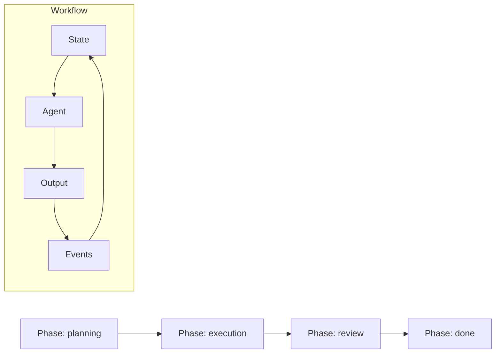

# Core Concepts

**The mental models that power Open Harness.**

---

Open Harness is built on four foundational concepts. Understanding these will help you design better workflows and debug faster when things go wrong.

## The Big Picture

Open Harness is a **state-first workflow runtime** for AI agents. Instead of treating AI as a black box, it makes every step explicit and testable:

```
┌─────────────────────────────────────────────────────────┐
│  WORKFLOW                                               │
│                                                         │
│  Events → State → Agent → Output → Events → State...   │
│                                                         │
└─────────────────────────────────────────────────────────┘
```

Everything that happens is recorded as an **event**. State is derived by replaying events. This simple insight unlocks powerful capabilities: time-travel debugging, deterministic testing, and session forking.

## The Four Concepts

<div class="grid cards" markdown>

-   :material-playlist-play:{ .lg .middle } __Events__

    ---

    Immutable facts about what happened. State is derived from events—never stored directly.

    [:octicons-arrow-right-24: Learn about Events](events.md)

-   :material-robot:{ .lg .middle } __Agents__

    ---

    Pure functions that take state, call an LLM, and return structured output.

    [:octicons-arrow-right-24: Learn about Agents](agents.md)

-   :material-view-sequential:{ .lg .middle } __Phases__

    ---

    Named stages that control workflow progression with explicit transitions.

    [:octicons-arrow-right-24: Learn about Phases](phases.md)

-   :material-sitemap:{ .lg .middle } __Workflows__

    ---

    Compositions that bring together state, phases, and agents into a runnable unit.

    [:octicons-arrow-right-24: Learn about Workflows](workflows.md)

</div>

## How They Fit Together



1. **Workflows** define the overall structure: initial state, phases, and how input is processed
2. **Phases** are stages in the workflow, each running an agent and specifying what comes next
3. **Agents** are the AI actors—they read state, call the LLM, and produce structured output
4. **Events** record everything that happens, making state reproducible and debuggable

## Recommended Reading Order

| Order | Concept | Why First |
|-------|---------|-----------|
| 1 | [Events](events.md) | Understand the foundation—state is derived from events |
| 2 | [Agents](agents.md) | Learn how AI actors work as pure functions |
| 3 | [Phases](phases.md) | See how stages control workflow progression |
| 4 | [Workflows](workflows.md) | Put it all together into runnable compositions |

## Quick Reference

| Concept | Mental Model | Key Insight |
|---------|--------------|-------------|
| **Events** | VCR tape | State is just "where we are on the tape" |
| **Agents** | Pure function | `State → LLM → Structured Output` |
| **Phases** | State machine | Explicit transitions, no hidden logic |
| **Workflows** | Composition | Single source of truth for everything |

---

!!! tip "Start with Events"
    If you only read one page, read [Events](events.md). The event-sourced architecture is the key insight that enables deterministic testing and time-travel debugging.
