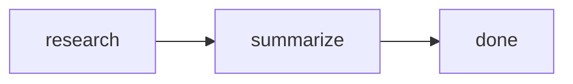
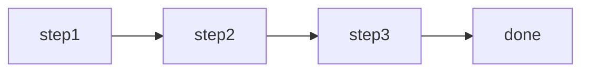
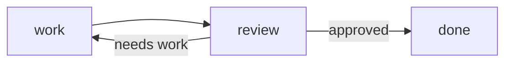
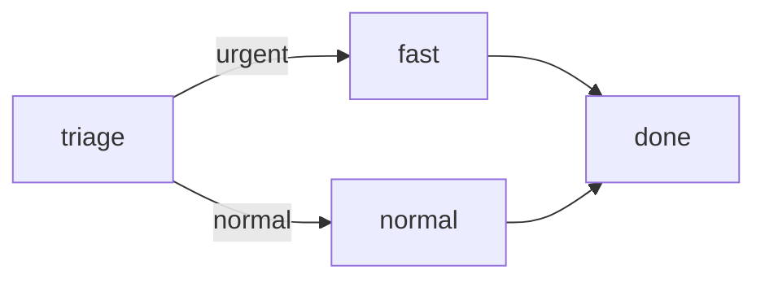

# Phases

**Named stages that control workflow progression.**

---

Phases are the stages of your workflow. Each phase runs an agent and specifies where to go next. This explicit control flow makes workflows predictable, debuggable, and easy to reason about.

## Phases Are Named Stages

Every phase has a unique name and defines what happens when the workflow enters it:

```typescript
import { workflow, phase } from "@open-harness/core"

const myWorkflow = workflow({
  name: "research-flow",
  initialState: { topic: "", findings: [], summary: "" },
  start: (input, draft) => { draft.topic = input },

  phases: {
    research: { run: researchAgent, next: "summarize" },
    summarize: { run: summaryAgent, next: "done" },
    done: phase.terminal()
  }
})
```

This creates a clear execution path:



## Phase Anatomy

Each phase has up to three parts:

```typescript
{
  // Required: the agent to run
  run: myAgent,

  // Required: where to go next (static or dynamic)
  next: "next-phase",

  // Optional: condition for entering this phase
  when: (state) => state.needsWork
}
```

### The `run` Property

Specifies which agent executes in this phase:

```typescript
phases: {
  planning: { run: plannerAgent, next: "execution" },
  execution: { run: workerAgent, next: "review" }
}
```

Each phase runs exactly one agent. If you need multiple agents, use multiple phases.

### The `next` Property

Specifies the next phase. Can be static or dynamic:

```typescript
// Static: always go to the same phase
{ run: agent, next: "review" }

// Dynamic: choose based on output or state
{
  run: agent,
  next: (output, state) => output.needsRevision ? "revise" : "done"
}
```

### The `when` Property

Optional condition for phase entry:

```typescript
phases: {
  optional: {
    run: optionalAgent,
    next: "done",
    when: (state) => state.needsOptionalStep
  }
}
```

If `when` returns `false`, the phase is skipped and the workflow moves to `next`.

## Phase Patterns

### Sequential

The simplest pattern—phases run in order:

```typescript
phases: {
  step1: { run: agent1, next: "step2" },
  step2: { run: agent2, next: "step3" },
  step3: { run: agent3, next: "done" },
  done: phase.terminal()
}
```



### Loop

Repeat until a condition is met:

```typescript
phases: {
  work: {
    run: workerAgent,
    next: "review"
  },
  review: {
    run: reviewerAgent,
    next: (output) => output.approved ? "done" : "work"
  },
  done: phase.terminal()
}
```



!!! warning "Prevent Infinite Loops"
    Add a maximum iteration count in your state to prevent runaway loops:
    ```typescript
    next: (output, state) => {
      if (state.iterations >= 5) return "done"
      return output.approved ? "done" : "work"
    }
    ```

### Branch

Different paths based on conditions:

```typescript
phases: {
  triage: {
    run: triageAgent,
    next: (output) => output.urgent ? "fast" : "normal"
  },
  fast: { run: fastAgent, next: "done" },
  normal: { run: normalAgent, next: "done" },
  done: phase.terminal()
}
```



### Parallel Merge

Multiple paths that converge:

```typescript
phases: {
  start: { run: startAgent, next: "pathA" },

  pathA: { run: agentA, next: "merge" },
  pathB: { run: agentB, next: "merge" },

  merge: {
    run: mergeAgent,
    next: "done",
    when: (state) => state.pathADone && state.pathBDone
  },
  done: phase.terminal()
}
```

## Terminal Phases

Every workflow needs at least one terminal phase—a phase that ends execution:

```typescript
import { phase } from "@open-harness/core"

phases: {
  // ... other phases ...
  done: phase.terminal(),
  failed: phase.terminal()  // Multiple terminals are fine
}
```

Terminal phases:

- Run no agent
- Emit a `workflow:completed` event
- Return the final state

## Dynamic Next Functions

The `next` function receives the agent output and current state:

```typescript
{
  run: reviewAgent,
  next: (output, state) => {
    // Access agent output
    if (output.score < 0.5) return "revise"

    // Access current state
    if (state.iterations >= 3) return "done"

    // Default path
    return "finalize"
  }
}
```

This enables complex routing logic without hidden state machines.

## Phase Events

Phases emit events for observability:

```typescript
execution.subscribe({
  onPhaseChanged: (phase, previousPhase) => {
    console.log(`${previousPhase} → ${phase}`)
  }
})
```

Events include:

- `phase:entered` — Entered a new phase
- `phase:exited` — Left a phase

## Phase Rules

1. **Unique names** — Each phase has a distinct identifier
2. **One agent per phase** — Each non-terminal phase runs exactly one agent
3. **Explicit next** — Every phase specifies where to go (or is terminal)
4. **No orphans** — Every phase must be reachable from the start phase

## Example: Review Loop

A common pattern—iterate until quality is acceptable:

```typescript
const reviewWorkflow = workflow({
  name: "review-loop",
  initialState: {
    draft: "",
    feedback: "",
    approved: false,
    iterations: 0
  },
  start: (input, draft) => { draft.draft = input },

  phases: {
    write: {
      run: writerAgent,
      next: "review"
    },
    review: {
      run: reviewerAgent,
      next: (output, state) => {
        if (output.approved) return "done"
        if (state.iterations >= 3) return "done"  // Max iterations
        return "revise"
      }
    },
    revise: {
      run: revisionAgent,
      next: "review"
    },
    done: phase.terminal()
  }
})
```

## Summary

| Pattern | Use Case | Example |
|---------|----------|---------|
| **Sequential** | Linear pipelines | `planning → execution → review` |
| **Loop** | Retry until satisfied | `work ↔ review → done` |
| **Branch** | Conditional paths | `triage → fast OR normal` |
| **Terminal** | End execution | `phase.terminal()` |

!!! info "Design Principle"
    Phases make control flow explicit. There's no hidden state machine—you can trace exactly how the workflow progresses by reading the phase definitions.

---

## Next

See how [Workflows](workflows.md) bring together state, phases, and agents into a single runnable unit.
