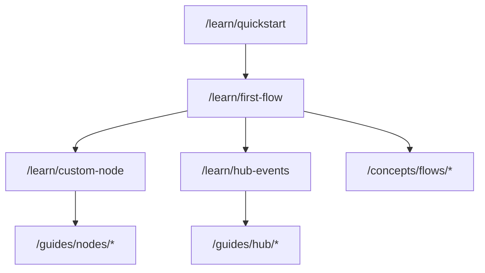

# Documentation Site Structure

**Based on**: ADR-001, Diátaxis Framework, Research Findings
**Framework**: Fumadocs (existing)
**Versioning**: Single version (latest)

---

## Top-Level Navigation

```
/                           # Landing page
├── /learn/                 # TUTORIALS (Learning + Practical)
├── /guides/                # HOW-TO GUIDES (Application + Practical)
├── /reference/             # REFERENCE (Application + Theoretical)
├── /concepts/              # EXPLANATION (Learning + Theoretical)
└── /contributing/          # CONTRIBUTOR TRACK
```

---

## Detailed Structure

### Landing Page (/)
- Hero: "Build AI Workflows with Open Harness"
- Quick links to: First Flow tutorial, API Reference, Concepts
- Install command: `bun add @open-harness/kernel`
- 3-column feature highlights: Flows, Hub Events, Channels

---

### Tutorials (/learn/)

Learning-oriented, hands-on experiences. User follows step-by-step to build competency.

```
/learn/
├── index.mdx                    # Overview: What you'll learn
├── quickstart.mdx               # 5-min first flow (P1 - CRITICAL)
├── first-flow.mdx               # Complete tutorial: YAML flow end-to-end
├── custom-node.mdx              # Build a custom NodeTypeDefinition
├── hub-events.mdx               # Subscribe to and handle Hub events
├── channels.mdx                 # Attach a console channel
├── testing.mdx                  # Write tests for your flows
└── advanced/
    ├── conditional-flows.mdx    # When expressions and branching
    ├── bindings-deep-dive.mdx   # A3 binding syntax mastery
    └── multi-agent.mdx          # Orchestrating multiple agents
```

**Priority**: P3 (After reference and concepts are solid)
**Audience**: Flow SDK Consumer (beginner-intermediate)

---

### How-to Guides (/guides/)

Task-oriented, problem-solving. User knows what they want, needs directions.

```
/guides/
├── index.mdx                    # Index: Find the guide you need
├── flows/
│   ├── parse-yaml-flow.mdx      # How to parse and validate YAML flows
│   ├── execute-flow.mdx         # How to execute a compiled flow
│   ├── flow-inputs.mdx          # How to pass inputs to flows
│   ├── conditional-execution.mdx # How to conditionally skip nodes
│   └── error-handling.mdx       # How to handle flow errors gracefully
├── nodes/
│   ├── register-nodes.mdx       # How to register custom node types
│   ├── node-schemas.mdx         # How to define input/output schemas
│   ├── node-capabilities.mdx    # How to declare node capabilities
│   └── async-nodes.mdx          # How to build async node implementations
├── hub/
│   ├── subscribe-events.mdx     # How to subscribe to Hub events
│   ├── emit-events.mdx          # How to emit custom events
│   ├── event-context.mdx        # How to use EventContext (phase/task)
│   └── scoped-subscriptions.mdx # How to scope subscriptions by context
├── channels/
│   ├── attach-channel.mdx       # How to attach a channel to Hub
│   ├── console-channel.mdx      # How to build a console channel
│   ├── voice-channel.mdx        # How to integrate voice (rtv-channel)
│   └── bidirectional-io.mdx     # How to handle inbox/outbox patterns
├── agents/
│   ├── define-agent.mdx         # How to define an AgentDefinition
│   ├── anthropic-agent.mdx      # How to use the Anthropic provider
│   └── agent-inbox.mdx          # How to use agent inbox for bidirectional
├── testing/
│   ├── unit-tests.mdx           # How to write unit tests for nodes
│   ├── replay-tests.mdx         # How to record and replay fixtures
│   └── live-tests.mdx           # How to run live integration tests
└── debugging/
    ├── debug-flows.mdx          # How to debug flow execution
    ├── inspect-events.mdx       # How to inspect Hub event stream
    ├── common-errors.mdx        # How to fix common errors
    └── binding-resolution.mdx   # How to debug A3 binding issues
```

**Priority**: P3 (After reference and concepts are solid)
**Audience**: Flow SDK Consumer, Node Type Developer

---

### Reference (/reference/)

Information-oriented, technical facts. Consulted, not read sequentially.

```
/reference/
├── index.mdx                    # Reference index
├── api/
│   ├── index.mdx                # API overview
│   ├── define-harness.mdx       # defineHarness() function
│   ├── hub.mdx                  # Hub class and methods
│   ├── execute-flow.mdx         # executeFlow() function
│   ├── node-registry.mdx        # NodeRegistry class
│   ├── parse-flow.mdx           # parseFlowYaml() function
│   ├── compile-flow.mdx         # compileFlow() function
│   ├── resolve-bindings.mdx     # resolveBindings() function
│   ├── evaluate-when.mdx        # evaluateWhen() function
│   └── anthropic-agent.mdx      # createAnthropicTextAgent() function
├── types/
│   ├── flow-yaml.mdx            # FlowYaml interface
│   ├── node-spec.mdx            # NodeSpec interface
│   ├── node-type-definition.mdx # NodeTypeDefinition interface
│   ├── agent-definition.mdx     # AgentDefinition interface
│   ├── channel-definition.mdx   # ChannelDefinition interface
│   ├── event-context.mdx        # EventContext interface
│   ├── base-event.mdx           # BaseEvent union type
│   └── enriched-event.mdx       # EnrichedEvent interface
├── schemas/
│   ├── flow-yaml-schema.mdx     # FlowYaml Zod schema
│   ├── node-spec-schema.mdx     # NodeSpec Zod schema
│   └── when-expr-schema.mdx     # WhenExpr Zod schema
├── events/
│   ├── workflow-events.mdx      # Workflow lifecycle events
│   ├── agent-events.mdx         # Agent execution events
│   ├── session-events.mdx       # Interactive session events
│   └── narrative-events.mdx     # Narrative/logging events
├── bindings/
│   ├── a3-syntax.mdx            # A3 binding syntax reference
│   └── binding-errors.mdx       # Binding error codes
├── when/
│   ├── when-syntax.mdx          # WhenExpr syntax reference
│   └── operators.mdx            # equals, and, or, not operators
├── config/
│   ├── harness-config.mdx       # HarnessFactory configuration
│   └── flow-config.mdx          # Flow execution configuration
└── kernel-spec/                 # Synced from packages/kernel/docs
    ├── index.mdx                # Spec entry point (for deep dives)
    └── [synced spec files]      # Auto-synced via script
```

**Priority**: P1 - Foundation (Do first)
**Audience**: All (lookup as needed)

---

### Concepts (/concepts/)

Understanding-oriented, discursive. Builds conceptual knowledge.

```
/concepts/
├── index.mdx                    # Concepts overview
├── architecture/
│   ├── overview.mdx             # High-level architecture
│   ├── kernel-primitives.mdx    # Hub, Agent, Channel, Flow
│   ├── harness-vs-flow.mdx      # When to use each runtime model
│   └── event-driven.mdx         # Event-driven design philosophy
├── flows/
│   ├── dag-model.mdx            # Understanding DAG execution
│   ├── binding-system.mdx       # Why A3 bindings work this way
│   ├── when-expressions.mdx     # Conditional execution model
│   └── node-lifecycle.mdx       # Node execution lifecycle
├── hub/
│   ├── event-bus.mdx            # Hub as central event bus
│   ├── context-propagation.mdx  # AsyncLocalStorage and context
│   └── commands-vs-events.mdx   # Events out, commands in
├── channels/
│   ├── adapter-pattern.mdx      # Channel as adapter
│   └── bidirectional.mdx        # Understanding bidirectional I/O
├── agents/
│   ├── execution-model.mdx      # How agents execute
│   └── inbox-pattern.mdx        # Inbox for bidirectional comms
├── testing/
│   ├── replay-model.mdx         # Understanding fixture replay
│   └── conformance.mdx          # Conformance testing philosophy
└── design-decisions/
    ├── naming.mdx               # Why "flow" not "workflow"
    ├── edges-required.mdx       # Why explicit edges
    └── bindings-a3.mdx          # Why A3 binding syntax
```

**Priority**: P1 - Foundation (Do alongside reference)
**Audience**: All (deeper understanding)

---

### Contributing (/contributing/)

Contributor track: architecture, testing, extension points.

```
/contributing/
├── index.mdx                    # Contributor welcome
├── setup.mdx                    # Dev environment setup (Bun, etc.)
├── architecture/
│   ├── overview.mdx             # Codebase architecture
│   ├── packages.mdx             # Package structure (kernel, rtv-channel)
│   ├── protocol-vs-engine.mdx   # Protocol/implementation split
│   └── directory-layout.mdx     # src/ structure explanation
├── development/
│   ├── workflow.mdx             # Development workflow
│   ├── testing.mdx              # Test strategy (unit, replay, live)
│   ├── fixtures.mdx             # Golden fixture recording
│   └── conformance.mdx          # Conformance testing process
├── extending/
│   ├── custom-nodes.mdx         # Adding built-in node types
│   ├── new-channel.mdx          # Building a new channel package
│   └── new-provider.mdx         # Adding a new AI provider
├── specifications/
│   ├── reading-specs.mdx        # How to read kernel specs
│   ├── spec-to-code.mdx         # Implementing from specs
│   └── traceability.mdx         # Spec → test → code mapping
└── releasing/
    ├── versioning.mdx           # Versioning strategy
    └── changelog.mdx            # Changelog process
```

**Priority**: P2 (Parallel with user guides)
**Audience**: Core Contributor

---

## Priority Summary

| Priority | Sections | Rationale |
|----------|----------|-----------|
| P1 | `/reference/`, `/concepts/` | Foundation: Document stable external interfaces first |
| P2 | `/contributing/` | Enable contributors once API is documented |
| P3 | `/learn/`, `/guides/` | Tutorials and how-tos built on solid foundation |

---

## Content Dependencies



Tutorials unlock guides; guides reference concepts; all reference /reference/.

---

## Migration from Current Structure

Current (`apps/docs/content/docs/`):
- `learn/` → Maps to new `/learn/` (stubs → fill)
- `guides/` → Maps to new `/guides/` (stubs → fill)
- `concepts/` → Maps to new `/concepts/` (partial → complete)
- `reference/api/` → Maps to new `/reference/api/` (partial → complete)
- `reference/kernel-spec/` → Keep sync mechanism

Actions:
1. Reorganize navigation in `apps/docs/` to match new structure
2. Fill stubs with translated spec content
3. Create missing pages
4. Update sidebar/navigation config
