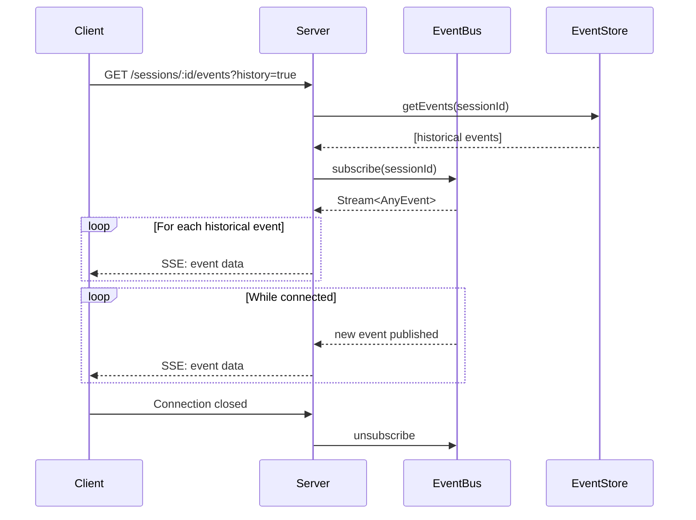

# Architecture

**System internals for SDK contributors.**

This document explains how Open Scaffold works under the hood. For usage, see [Building Workflows](./building-workflows.md). For core concepts, see [Concepts](./concepts.md).

---

## Table of Contents

1. [Package Structure](#package-structure)
2. [Event Sourcing](#event-sourcing)
3. [Stream Architecture](#stream-architecture)
4. [Database Model](#database-model)
5. [Provider System](#provider-system)
6. [Service Architecture](#service-architecture)
7. [Data Flow Diagrams](#data-flow-diagrams)

---

## Package Structure

Open Scaffold is organized into four packages with clear dependency boundaries:

```
                    ┌─────────────────────────────────────────┐
                    │            @open-scaffold/client        │
                    │                                         │
                    │   HttpClient, React hooks, SSE parsing  │
                    │   Pure HTTP/SSE - no Effect runtime     │
                    └─────────────────────┬───────────────────┘
                                          │
                                   HTTP/SSE Protocol
                                          │
                                          ▼
┌─────────────────────────────────────────┴───────────────────────────────────────────┐
│                              @open-scaffold/server                                  │
│                                                                                     │
│   OpenScaffold facade, HTTP routes, SSE endpoints, AnthropicProvider               │
│   LibSQL store implementations (EventStoreLive, ProviderRecorderLive, etc.)        │
│                                                                                     │
│   Depends on: @open-scaffold/core, effect, @effect/sql-libsql, anthropic-sdk       │
└─────────────────────────────────────────┬───────────────────────────────────────────┘
                                          │
                                          │ imports
                                          ▼
┌─────────────────────────────────────────────────────────────────────────────────────┐
│                              @open-scaffold/core                                    │
│                                                                                     │
│   Domain types, Service Tags, Engine (agent/phase/workflow/runtime)                │
│   Pure Effect programs - no concrete implementations                               │
│                                                                                     │
│   Depends on: effect, zod, immer                                                   │
└─────────────────────────────────────────────────────────────────────────────────────┘

┌─────────────────────────────────────────────────────────────────────────────────────┐
│                              @open-scaffold/testing                                 │
│                                                                                     │
│   Pre-recorded API responses for deterministic playback testing                    │
│                                                                                     │
│   Used by: all packages (devDependency)                                            │
└─────────────────────────────────────────────────────────────────────────────────────┘
```

### Package Responsibilities

| Package | Responsibility | Key Exports |
|---------|----------------|-------------|
| `@open-scaffold/core` | Domain types, service interfaces, workflow runtime | `agent()`, `phase()`, `workflow()`, `run()`, `Services.*` |
| `@open-scaffold/server` | HTTP server, storage implementations, Anthropic provider | `OpenScaffold`, `AnthropicProvider`, `EventStoreLive` |
| `@open-scaffold/client` | HTTP client, React integration, SSE parsing | `HttpClient`, `useWorkflowState`, `WorkflowProvider` |
| `@open-scaffold/testing` | Pre-recorded API responses, test helpers | `recordingsDbPath`, `recordingsDbUrl`, `getRandomPort()` |

### Core Package Structure

```
packages/core/src/
├── Domain/           # Foundational types
│   ├── Ids.ts        # Branded IDs (SessionId, EventId, WorkflowId)
│   ├── Errors.ts     # Tagged errors (StoreError, ProviderError, etc.)
│   ├── Context.ts    # SessionContext FiberRef
│   ├── Hash.ts       # Request hashing for recording
│   ├── Provider.ts   # AgentProvider types
│   └── Interaction.ts # HITL interaction types
│
├── Services/         # Effect Context.Tag definitions (interfaces only)
│   ├── EventStore.ts
│   ├── EventBus.ts
│   ├── StateSnapshotStore.ts
│   ├── ProviderRecorder.ts
│   ├── ProviderMode.ts
│   ├── AgentProvider.ts
│   └── StateCache.ts
│
├── Engine/           # Workflow execution runtime
│   ├── agent.ts      # agent() builder
│   ├── phase.ts      # phase() builder
│   ├── workflow.ts   # workflow() builder
│   ├── runtime.ts    # Effect-based executeWorkflow, streamWorkflow
│   ├── execute.ts    # Async iterator API
│   ├── run.ts        # Simple Promise API
│   ├── provider.ts   # runAgentDef (agent execution with recording)
│   ├── types.ts      # Events, payloads, WorkflowResult
│   └── utils.ts      # computeStateAt (pure function)
│
└── Layers/           # Service implementations
    ├── InMemory.ts   # InMemoryEventHub (PubSub-based, real implementation)
    └── LibSQL.ts     # EventStoreLive, StateSnapshotStoreLive, ProviderRecorderLive
```

### Server Package Structure

```
packages/server/src/
├── OpenScaffold.ts   # Public facade (hides Effect from users)
├── constants.ts      # DEFAULT_PORT = 42069
│
├── http/
│   ├── Server.ts     # createServer, ServerConfig
│   ├── Routes.ts     # Route handlers (createSessionRoute, etc.)
│   └── SSE.ts        # SSE formatting, eventStreamToSSE
│
├── provider/
│   └── Provider.ts   # AnthropicProvider implementation
│
├── programs/         # Reusable Effect programs
│   ├── forkSession.ts
│   ├── loadSession.ts
│   ├── observeEvents.ts
│   ├── recordEvent.ts
│   └── resumeSession.ts
│
├── services/
│   └── EventBusLive.ts
│
└── store/            # LibSQL implementations
    ├── Config.ts
    ├── Migrations.ts
    ├── EventStoreLive.ts
    ├── StateSnapshotStoreLive.ts
    └── ProviderRecorderLive.ts
```

---

## Event Sourcing

Open Scaffold uses **event sourcing** as its persistence model. Events are the source of truth; state is derived.

### Core Principle

```
State = reduce(Events, initialState)
```

Every change produces an **immutable event**. Current state is computed by replaying events from the beginning (or from a snapshot checkpoint).

### Event Structure

```typescript
interface Event<N extends string = string, P = unknown> {
  readonly id: EventId        // UUID v4, branded
  readonly name: N            // Event type (e.g., "state:updated")
  readonly payload: P         // Event-specific data
  readonly timestamp: Date    // When created
  readonly causedBy?: EventId // Causality tracking
}
```

### Framework Events

The framework generates these events automatically during workflow execution:

| Event | Payload | When Emitted |
|-------|---------|--------------|
| `workflow:started` | `{ sessionId, workflowName, input }` | Workflow begins |
| `workflow:completed` | `{ sessionId, finalState, exitPhase? }` | Workflow ends |
| `phase:entered` | `{ phase, fromPhase? }` | Phase transition |
| `phase:exited` | `{ phase, reason }` | Phase ends |
| `agent:started` | `{ agentName, phase?, context? }` | Agent execution begins |
| `agent:completed` | `{ agentName, output, durationMs }` | Agent execution ends |
| `state:updated` | `{ state, patches?, inversePatches? }` | State changed (via Immer) |
| `text:delta` | `{ agentName, delta }` | Streaming text chunk |
| `thinking:delta` | `{ agentName, delta }` | Streaming thinking chunk |
| `tool:called` | `{ agentName, toolId, toolName, input }` | Tool invocation |
| `tool:result` | `{ agentName, toolId, output, isError }` | Tool result |
| `input:requested` | Phase: `{ promptText, inputType, options? }`<br/>Interaction: `{ interactionId, agentName, prompt, inputType, options? }` | HITL pause |
| `input:response` | `{ response }` | HITL resume |

### State Computation

State is computed from events using `computeStateAt`:

```typescript
// Pure function - no services required
const computeStateAt = <S>(
  events: ReadonlyArray<AnyEvent>,
  position: number
): S | null => {
  // Find the last state:updated event at or before position
  for (let i = Math.min(position, events.length) - 1; i >= 0; i--) {
    if (events[i].name === "state:updated") {
      return (events[i].payload as { state: S }).state
    }
  }
  return null
}
```

### Why Event Sourcing?

1. **Complete audit trail** - Every action is recorded
2. **Time travel** - Navigate to any point in history
3. **Deterministic replay** - Re-execute from events
4. **Debugging** - Inspect exactly what happened
5. **Forking** - Copy events to create alternate timelines

---

## Stream Architecture

Open Scaffold uses Effect's `Stream` type for real-time event delivery.

### Stream Flow

```
┌───────────────────┐     ┌───────────────────┐     ┌───────────────────┐
│   Agent Provider  │────▶│   Runtime Engine  │────▶│     EventBus      │
│   (streaming SDK) │     │   (emits events)  │     │   (pub/sub)       │
└───────────────────┘     └───────────────────┘     └───────────────────┘
                                   │                         │
                                   ▼                         ▼
                          ┌───────────────────┐     ┌───────────────────┐
                          │    EventStore     │     │   SSE Endpoint    │
                          │    (persistence)  │     │   (clients)       │
                          └───────────────────┘     └───────────────────┘
```

### Effect Stream Patterns

**Provider streaming:**

```typescript
// AgentProvider.stream returns Stream.Stream<AgentStreamEvent, ProviderError>
interface AgentProviderService {
  readonly stream: (options: AgentRunOptions) =>
    Stream.Stream<AgentStreamEvent, ProviderError>
}
```

**EventBus subscription:**

```typescript
// EventBus.subscribe returns Stream.Stream<AnyEvent, never>
interface EventBusService {
  readonly subscribe: (sessionId: SessionId) =>
    Stream.Stream<AnyEvent, never>
}
```

**SSE conversion:**

```typescript
// Convert Effect Stream to SSE response body
const eventStreamToSSE = (
  stream: Stream.Stream<AnyEvent, never>
): ReadableStream<Uint8Array> =>
  Stream.runFold(stream, /* ... format as SSE */)
```

### Dual Persistence

Every event is:
1. **Persisted** to EventStore (durability)
2. **Published** to EventBus (real-time)

```typescript
// From runtime.ts emitEvent
const emitEvent = (ctx, name, payload) =>
  Effect.gen(function*() {
    const event = yield* makeEvent(name, payload, causedBy)

    // Persist (durable)
    const store = yield* EventStore
    yield* store.append(ctx.sessionId, event)

    // Broadcast (ephemeral)
    const bus = yield* EventBus
    yield* bus.publish(ctx.sessionId, event)

    return event
  })
```

---

## Database Model

Open Scaffold uses a **single LibSQL database** for all persistence.

### Schema

```sql
-- Sessions (metadata)
CREATE TABLE sessions (
  id TEXT PRIMARY KEY,
  workflow_name TEXT,
  created_at TEXT NOT NULL,
  completed_at TEXT,
  metadata TEXT
);

-- Events (the tape)
CREATE TABLE events (
  id TEXT PRIMARY KEY,
  session_id TEXT NOT NULL,
  position INTEGER NOT NULL,
  name TEXT NOT NULL,
  payload TEXT NOT NULL,      -- JSON
  timestamp TEXT NOT NULL,
  caused_by TEXT,
  UNIQUE(session_id, position)
);

-- State snapshots (checkpoints)
CREATE TABLE state_snapshots (
  session_id TEXT NOT NULL,
  position INTEGER NOT NULL,
  state_json TEXT NOT NULL,
  created_at TEXT NOT NULL,
  PRIMARY KEY (session_id, position)
);

-- Provider recordings (for playback)
CREATE TABLE provider_recordings (
  id TEXT PRIMARY KEY,
  request_hash TEXT NOT NULL UNIQUE,
  prompt TEXT NOT NULL,
  provider TEXT NOT NULL,
  response TEXT NOT NULL,     -- JSON (AgentRunResult)
  recorded_at TEXT NOT NULL,
  stream_transcript TEXT      -- JSON array of AgentStreamEvent
);

-- Incremental recording sessions
CREATE TABLE recording_sessions (
  recording_id TEXT PRIMARY KEY,
  request_hash TEXT NOT NULL,
  prompt TEXT NOT NULL,
  provider TEXT NOT NULL,
  status TEXT NOT NULL DEFAULT 'in_progress',
  response TEXT,
  created_at TEXT NOT NULL,
  completed_at TEXT
);

-- Incremental recording events
CREATE TABLE recording_events (
  id INTEGER PRIMARY KEY AUTOINCREMENT,
  recording_id TEXT NOT NULL,
  event_index INTEGER NOT NULL,
  event_data TEXT NOT NULL,   -- JSON (AgentStreamEvent)
  created_at TEXT NOT NULL,
  UNIQUE(recording_id, event_index)
);
```

### Table Purposes

| Table | Purpose | Accessed By |
|-------|---------|-------------|
| `sessions` | Session metadata | ListSessions, GetSession |
| `events` | Event log (the tape) | EventStore |
| `state_snapshots` | Checkpoint state for fast resume | StateSnapshotStore |
| `provider_recordings` | Recorded provider responses | ProviderRecorder |
| `recording_sessions` | In-progress incremental recordings | ProviderRecorder |
| `recording_events` | Individual stream events during recording | ProviderRecorder |

### Why Single Database?

1. **Transactional consistency** - Events and recordings can be atomic
2. **Simple deployment** - One file to backup/restore
3. **LibSQL benefits** - SQLite compatible, works in-memory for tests

---

## Provider System

The provider system abstracts LLM SDK interactions behind a common interface.

### AgentProvider Interface

```typescript
interface AgentProviderService {
  // Get complete result (non-streaming)
  readonly run: (options: AgentRunOptions) =>
    Effect.Effect<AgentRunResult, ProviderError>

  // Stream events as they occur
  readonly stream: (options: AgentRunOptions) =>
    Stream.Stream<AgentStreamEvent, ProviderError>

  // Provider metadata
  readonly info: () => Effect.Effect<ProviderInfo, never>
}
```

### Stream Event Types

```typescript
type AgentStreamEvent =
  | { _tag: "TextDelta"; delta: string }
  | { _tag: "TextComplete"; text: string }
  | { _tag: "ThinkingDelta"; delta: string }
  | { _tag: "ThinkingComplete"; thinking: string }
  | { _tag: "ToolCall"; toolId: string; toolName: string; input: unknown }
  | { _tag: "ToolResult"; toolId: string; output: unknown; isError: boolean }
  | { _tag: "Stop"; reason: "end_turn" | "tool_use" | "max_tokens" }
  | { _tag: "Usage"; inputTokens: number; outputTokens: number }
  | { _tag: "Result"; output: unknown; stopReason: string; ... }
```

### Recording/Playback Flow

```
                          ┌─────────────────┐
                          │  ProviderMode   │
                          │  Context        │
                          └────────┬────────┘
                                   │
                    ┌──────────────┴──────────────┐
                    │                             │
                    ▼                             ▼
              mode="live"                  mode="playback"
                    │                             │
                    ▼                             ▼
         ┌──────────────────┐         ┌──────────────────┐
         │ Call real API    │         │ Load from        │
         │ via Provider     │         │ ProviderRecorder │
         └────────┬─────────┘         └────────┬─────────┘
                  │                             │
                  ▼                             ▼
         ┌──────────────────┐         ┌──────────────────┐
         │ Record events    │         │ Replay recorded  │
         │ incrementally    │         │ stream events    │
         └────────┬─────────┘         └──────────────────┘
                  │
                  ▼
         ┌──────────────────┐
         │ Finalize with    │
         │ AgentRunResult   │
         └──────────────────┘
```

### Request Hashing

Recordings are keyed by a hash of the request:

```typescript
const hashProviderRequest = (options: ProviderRunOptions): string => {
  // Hash: prompt + outputSchema + providerOptions
  return sha256(JSON.stringify({
    prompt: options.prompt,
    schema: options.outputSchema,
    options: options.providerOptions
  }))
}
```

This enables deterministic playback - same input produces same recorded output.

### Agent Provider Ownership (ADR-010)

Per [ADR-010](./plans/adr/010-provider-ownership-model.md), agents own their providers directly:

```typescript
// Agents embed their provider directly - no registry lookup
const planner = agent({
  name: "planner",
  provider: AnthropicProvider({ model: "claude-sonnet-4-5" }),
  output: planSchema,
  prompt: (state) => `Create a plan for: ${state.task}`,
  update: (output, draft) => { draft.plan = output.plan }
})
```

This enables:
- **Type safety** - Provider output type flows to agent output type
- **Simplified runtime** - No dependency on ProviderRegistry service
- **Variant creation** - Easy to create evaluation variants with different models

---

## Service Architecture

All services follow the **Tag + Interface + Layer** pattern from Effect.

### Pattern Overview

```
┌─────────────────────────────────────────────────────────────────────────┐
│  1. TAG (Context.Tag)                                                   │
│     - Unique identifier for dependency injection                        │
│     - Defined in @open-scaffold/core/Services                          │
│                                                                         │
│  class EventStore extends Context.Tag("@open-scaffold/EventStore")<    │
│    EventStore,                                                         │
│    EventStoreService                                                   │
│  >() {}                                                                │
└─────────────────────────────────────────────────────────────────────────┘
                                     │
                                     ▼
┌─────────────────────────────────────────────────────────────────────────┐
│  2. INTERFACE (Service type)                                            │
│     - Pure type definition, no implementation                           │
│     - Defines the contract                                              │
│                                                                         │
│  interface EventStoreService {                                         │
│    readonly append: (sessionId, event) => Effect<void, StoreError>     │
│    readonly getEvents: (sessionId) => Effect<Event[], StoreError>      │
│  }                                                                     │
└─────────────────────────────────────────────────────────────────────────┘
                                     │
                                     ▼
┌─────────────────────────────────────────────────────────────────────────┐
│  3. LAYER (Implementation)                                              │
│     - Concrete implementation                                           │
│     - Defined in @open-scaffold/server/store                           │
│                                                                         │
│  const EventStoreLive = (config: LibSQLConfig) =>                      │
│    Layer.effect(EventStore, Effect.gen(function*() {                   │
│      const sql = yield* SqlClient                                      │
│      yield* runMigrations(sql)                                         │
│      return { append: ..., getEvents: ... }                            │
│    }))                                                                 │
└─────────────────────────────────────────────────────────────────────────┘
```

### Service Definitions

#### EventStore

Persists events (the tape). Source of truth.

```typescript
// Tag + Interface (core)
interface EventStoreService {
  readonly append: (sessionId: SessionId, event: AnyEvent) =>
    Effect.Effect<void, StoreError>
  readonly getEvents: (sessionId: SessionId) =>
    Effect.Effect<ReadonlyArray<AnyEvent>, StoreError>
  readonly getEventsFrom: (sessionId: SessionId, position: number) =>
    Effect.Effect<ReadonlyArray<AnyEvent>, StoreError>
  readonly listSessions: () =>
    Effect.Effect<ReadonlyArray<SessionId>, StoreError>
  readonly deleteSession: (sessionId: SessionId) =>
    Effect.Effect<void, StoreError>
}

// Layer (server)
const EventStoreLive = (config: { url: string }) =>
  Layer.effect(EventStore, /* LibSQL implementation */)
```

#### EventBus

In-memory pub/sub for real-time SSE.

```typescript
// Tag + Interface (core)
interface EventBusService {
  readonly publish: (sessionId: SessionId, event: AnyEvent) =>
    Effect.Effect<void, never>
  readonly subscribe: (sessionId: SessionId) =>
    Stream.Stream<AnyEvent, never>
}

// Layer (server)
const EventBusLive: Effect.Effect<EventBusService, never>
// Uses Effect.PubSub internally
```

#### ProviderRecorder

Records and replays provider responses.

```typescript
// Tag + Interface (core)
interface ProviderRecorderService {
  readonly load: (hash: string) =>
    Effect.Effect<RecordingEntry | null, StoreError>
  readonly save: (entry: RecordingEntry) =>
    Effect.Effect<void, StoreError>
  // Incremental recording (crash-safe)
  readonly startRecording: (hash, metadata) =>
    Effect.Effect<string, StoreError>
  readonly appendEvent: (recordingId, event) =>
    Effect.Effect<void, StoreError>
  readonly finalizeRecording: (recordingId, result) =>
    Effect.Effect<void, StoreError>
}

// Layer (server)
const ProviderRecorderLive = (config: { url: string }) =>
  Layer.effect(ProviderRecorder, /* LibSQL implementation */)
```

#### StateSnapshotStore

Stores state checkpoints for fast resume.

```typescript
// Tag + Interface (core)
interface StateSnapshotStoreService {
  readonly save: (snapshot: StateSnapshot) =>
    Effect.Effect<void, StoreError>
  readonly load: (sessionId: SessionId, position?: number) =>
    Effect.Effect<StateSnapshot | null, StoreError>
}

// Layer (server)
const StateSnapshotStoreLive = (config: { url: string }) =>
  Layer.effect(StateSnapshotStore, /* LibSQL implementation */)
```

### Layer Composition

Layers are composed in OpenScaffold.create:

```typescript
const combinedLayer = Layer.mergeAll(
  EventStoreLive({ url: config.database }),
  StateSnapshotStoreLive({ url: config.database }),
  ProviderRecorderLive({ url: config.database }),
  Layer.effect(EventBus, EventBusLive),
  providerRegistryLayer,
  Layer.succeed(ProviderModeContext, { mode: config.mode })
)

const runtime = ManagedRuntime.make(combinedLayer)
```

---

## Data Flow Diagrams

### Workflow Execution Sequence

```
┌────────┐     ┌────────────┐     ┌───────────┐     ┌────────────┐
│ Client │     │   Server   │     │  Runtime  │     │  Provider  │
└───┬────┘     └─────┬──────┘     └─────┬─────┘     └─────┬──────┘
    │                │                  │                 │
    │ POST /sessions │                  │                 │
    │───────────────▶│                  │                 │
    │                │                  │                 │
    │                │ executeWorkflow  │                 │
    │                │─────────────────▶│                 │
    │                │                  │                 │
    │                │                  │ emit workflow:  │
    │                │                  │ started         │
    │                │                  │────────┐        │
    │                │                  │        │        │
    │                │                  │◀───────┘        │
    │                │                  │                 │
    │                │                  │ runAgentDef     │
    │                │                  │────────────────▶│
    │                │                  │                 │
    │                │                  │ stream events   │
    │                │                  │◀────────────────│
    │                │                  │                 │
    │                │                  │ emit text:delta │
    │                │                  │ emit agent:     │
    │                │                  │ completed       │
    │                │                  │                 │
    │                │                  │ updateState     │
    │                │                  │ (Immer)         │
    │                │                  │────────┐        │
    │                │                  │        │        │
    │                │                  │◀───────┘        │
    │                │                  │                 │
    │                │                  │ emit state:     │
    │                │                  │ updated         │
    │                │                  │                 │
    │ 201 Created    │                  │                 │
    │◀───────────────│                  │                 │
    │                │                  │                 │
    │ GET /sessions/ │                  │                 │
    │ :id/events     │                  │                 │
    │───────────────▶│                  │                 │
    │                │                  │                 │
    │   SSE stream   │◀─────────────────────EventBus      │
    │◀ ─ ─ ─ ─ ─ ─ ─ │                  │                 │
    │                │                  │                 │
```

### Event Persistence Flow

```
┌─────────────────────────────────────────────────────────────────────────┐
│                           emitEvent(ctx, name, payload)                 │
└────────────────────────────────────┬────────────────────────────────────┘
                                     │
                                     ▼
                          ┌──────────────────────┐
                          │   makeEvent(name,    │
                          │   payload, causedBy) │
                          │   generates UUID     │
                          └──────────┬───────────┘
                                     │
                    ┌────────────────┴────────────────┐
                    │                                 │
                    ▼                                 ▼
         ┌──────────────────────┐         ┌──────────────────────┐
         │    EventStore.       │         │    EventBus.         │
         │    append(session,   │         │    publish(session,  │
         │    event)            │         │    event)            │
         │                      │         │                      │
         │    DURABLE           │         │    EPHEMERAL         │
         │    (LibSQL)          │         │    (PubSub)          │
         └──────────────────────┘         └──────────────────────┘
                    │                                 │
                    ▼                                 ▼
         ┌──────────────────────┐         ┌──────────────────────┐
         │    events table      │         │    SSE connections   │
         │    (source of truth) │         │    (real-time)       │
         └──────────────────────┘         └──────────────────────┘
```

### Recording/Playback Flow

```
                              ┌──────────────────────┐
                              │  runAgentDef(agent,  │
                              │  state, context)     │
                              └──────────┬───────────┘
                                         │
                          ┌──────────────┴──────────────┐
                          │   ProviderModeContext       │
                          │   yield* ProviderModeContext│
                          └──────────────┬──────────────┘
                                         │
               ┌─────────────────────────┴─────────────────────────┐
               │                                                   │
               ▼                                                   ▼
        mode = "live"                                       mode = "playback"
               │                                                   │
               ▼                                                   ▼
   ┌───────────────────────┐                          ┌───────────────────────┐
   │ 1. startRecording     │                          │ 1. recorder.load(hash)│
   │    (get recordingId)  │                          │                       │
   │                       │                          │ 2. if (!entry)        │
   │ 2. provider.stream    │                          │    fail RecordingNot  │
   │    (call real API)    │                          │    Found              │
   │                       │                          │                       │
   │ 3. for each event:    │                          │ 3. replay recorded    │
   │    - appendEvent      │                          │    streamData events  │
   │    - map to internal  │                          │                       │
   │                       │                          │ 4. use recorded       │
   │ 4. finalizeRecording  │                          │    result             │
   │    (store result)     │                          │                       │
   └───────────────────────┘                          └───────────────────────┘
               │                                                   │
               └─────────────────────────┬─────────────────────────┘
                                         │
                                         ▼
                          ┌──────────────────────────────┐
                          │  Parse output via Zod schema │
                          │  Return AgentExecutionResult │
                          └──────────────────────────────┘
```

### Client SSE Connection



---

## Next Steps

- [Contributing](./contributing.md) - Development workflow
- [Concepts](./concepts.md) - Core mental models
- [Building Workflows](./building-workflows.md) - Usage guide
- [API Reference](./api-reference.md) - Complete API docs
