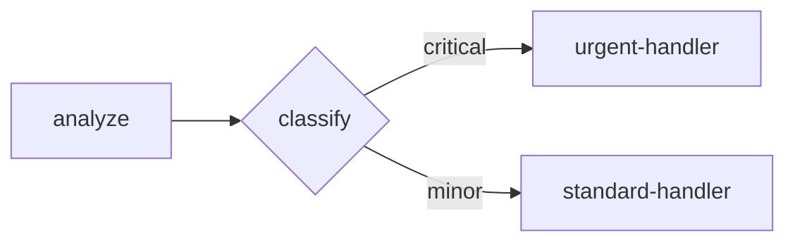

# Open Harness Documentation Writing Guide

Standards for consistent, high-quality documentation.

---

## Voice & Tone

### Do

| Pattern | Example |
|---------|---------|
| Direct imperatives | "Create a flow" |
| Short sentences | "Run this command." |
| Active voice | "The Hub broadcasts events" |
| Second person | "You can configure..." |
| Present tense | "This returns a snapshot" |

### Don't

| Pattern | Example |
|---------|---------|
| Passive constructions | "A flow should be created" |
| Hedging | "You might want to..." |
| Future tense | "This will return..." |
| Wordiness | "In order to create a flow, you will first need to..." |
| Meta-commentary | "In this section, we'll explore..." |

### Examples

**Bad:**
> In this guide, we'll explore how you can create flows. First, you might want to consider what kind of flow you'd like to build.

**Good:**
> Create a flow by defining nodes and edges. Start with a single node.

---

## Structure

### Page Template

```markdown
# [Action-Oriented Title]

[1-2 sentence intro: what and why]

## Prerequisites

- Completed [previous tutorial]
- Understanding of [concept]

## What You'll Build

[Screenshot or diagram of result]

## Steps

### Step 01: [Action]

[Brief explanation]

```code
[Minimal, labeled code block]
```

[What this does in 1 sentence]

### Step 02: [Action]

...

## What You Learned

- [Key concept 1]
- [Key concept 2]

## Next Steps

- [Link to next tutorial]
- [Link to related concept]
```

### Numbered Steps

Use visual step numbers (Tailwind pattern):

```
Step 01: Create the project
Step 02: Install dependencies
Step 03: Define your flow
Step 04: Run the flow
```

Not:
```
1. Create the project
Step 1: Create the project
First, create the project
```

### Code Blocks

Always label with filename:

```markdown
```yaml title="flow.yaml"
name: hello-world
nodes:
  - id: greet
    type: echo
```
```

```markdown
```typescript title="run.ts"
import { runFlow } from "@open-harness/server";
```
```

---

## Terminology

### Canonical Terms

Use these exact terms consistently:

| Term | Definition | Don't Use |
|------|------------|-----------|
| **flow** | A workflow definition | workflow, pipeline, graph |
| **node** | A step in a flow | step, stage, task, action |
| **edge** | A connection between nodes | link, connection, transition |
| **binding** | A `{{ }}` expression | interpolation, template, variable |
| **runtime** | The execution engine | harness, executor, runner |
| **snapshot** | Execution state at a point in time | state, result, output |

### Term Introduction

Define terms on first use:

**Good:**
> A **flow** is a workflow definition that describes which nodes to execute and how data flows between them.

**Bad:**
> Create a flow. The flow has nodes. The nodes have inputs.

### Avoid Internal Jargon

Don't expose implementation details:

| Internal | User-Facing |
|----------|-------------|
| Hub | Event system |
| Transport | Connection |
| Channel | Protocol |
| NodeTypeDefinition | Custom node |

---

## Code Examples

### Quality Checklist

- [ ] Imports are from actual packages (`@open-harness/core`, `@open-harness/server`)
- [ ] Function signatures match actual SDK
- [ ] Binding syntax is `{{ nodeId.field }}` (not `{{ nodes.X.output.Y }}`)
- [ ] Edge conditions use `when:` (not `condition:`)
- [ ] Can be copy-pasted and run
- [ ] Includes all necessary context (imports, setup)

### Minimal Examples

Show the minimum code needed. Add complexity only when teaching it.

**Good (Level 1):**
```yaml
name: hello-world
nodes:
  - id: greet
    type: echo
    input:
      text: "Hello!"
edges: []
```

**Bad (Level 1):**
```yaml
name: hello-world
version: 1
state:
  initial:
    count: 0
nodes:
  - id: greet
    type: echo
    input:
      text: "Hello!"
    config:
      timeout: 5000
      retry:
        attempts: 3
edges:
  - from: greet
    to: next
    when: "true"
```

### Progressive Complexity

Build on previous examples. Don't introduce multiple concepts at once.

Level N+1 should add ONE thing to Level N:
- Level 1: Single node
- Level 2: + State
- Level 3: + Data flow (bindings)
- Level 4: + Branching (when)
- Level 5: + Persistence
- Level 6: + Recording
- Level 7: + Evaluation

### Comments

Use comments sparingly. Code should be self-documenting.

**Good:**
```typescript
const store = new SqliteRunStore({ filename: "./runs.db" });
```

**Acceptable (complex logic):**
```typescript
// Resume from where we left off
const events = store.loadEvents(runId, lastSeq);
```

**Bad:**
```typescript
// Create a new SQLite run store
const store = new SqliteRunStore({ filename: "./runs.db" });
// Pass the store to the runtime
const runtime = createRuntime({ flow, registry, store });
// Run the flow with input
const snapshot = await runtime.run(input);
```

---

## Callouts

### Types

```markdown
<Callout type="tip" title="Tip">
Use `echo` nodes for debugging during development.
</Callout>

<Callout type="warning" title="Warning">
Don't store sensitive data in flow state.
</Callout>

<Callout type="stuck" title="Are you stuck?">
If you see `Error: Node type not found`, check that you registered your custom node in the registry.
</Callout>

<Callout type="note" title="Note">
This feature requires v0.2.0 or later.
</Callout>
```

### When to Use

| Type | Use For |
|------|---------|
| tip | Helpful shortcuts, best practices |
| warning | Potential issues, security considerations |
| stuck | Common errors and solutions (after each step) |
| note | Version requirements, limitations |

### "Are You Stuck?" Pattern

After each step in a tutorial, anticipate common failures:

```markdown
<Callout type="stuck" title="Are you stuck?">
**Error: Cannot find module '@open-harness/server'**
Run `bun install` to install dependencies.

**Error: ENOENT flow.yaml**
Make sure you're in the project directory: `cd my-flow`
</Callout>
```

---

## Paragraphs

### AI-Readability

- Max 3-5 lines per paragraph
- One idea per paragraph
- Short sentences (under 20 words preferred)
- Avoid long compound sentences

**Bad:**
> The Hub is responsible for coordinating communication between agents, managing event distribution, and maintaining the event log, which is essential for debugging and persistence, and it uses an internal event bus that broadcasts events to all registered listeners who can then filter and process them according to their needs.

**Good:**
> The Hub coordinates communication between agents. It broadcasts events to all registered listeners. Listeners can filter events by type.

### Headers

Headers should be specific and searchable.

| Bad | Good |
|-----|------|
| Overview | How the Runtime Executes Flows |
| Usage | Running a Flow with Custom Input |
| Configuration | Configuring Persistence Options |
| API | Runtime API Reference |

---

## Links

### Cross-References

Always link related content:

```markdown
See [Expressions](/docs/understand/expressions) for more on bindings.

This example builds on [Level 3: Data Flow](/docs/build/multi-node).

For API details, see the [Runtime Reference](/docs/reference/api/runtime).
```

### Next Steps

Every page should end with next steps:

```markdown
## Next Steps

- [Level 4: Conditional Branching](/docs/build/branching) - Add decision logic
- [Understanding Expressions](/docs/understand/expressions) - Deep dive on bindings
- [API Reference](/docs/reference/api/runtime) - Full Runtime API
```

---

## Tables

Use tables for:
- Configuration options
- API parameters
- Comparison of approaches

```markdown
| Option | Type | Default | Description |
|--------|------|---------|-------------|
| `filename` | `string` | required | Path to SQLite database |
| `verbose` | `boolean` | `false` | Enable debug logging |
```

---

## Images & Diagrams

### Mermaid Diagrams

Use for flow visualization:

```markdown

```

### Screenshots

- Capture at consistent window size
- Use light mode
- Highlight relevant areas
- Include alt text

---

## Versioning

### Version-Specific Content

When behavior differs by version:

```markdown
<Callout type="note">
This feature requires v0.2.0 or later.
</Callout>
```

### Deprecations

```markdown
<Callout type="warning" title="Deprecated">
`createHub()` is deprecated. Use `createRuntime()` instead.
</Callout>
```

---

## Checklist for Every Page

Before submitting:

- [ ] Title is action-oriented
- [ ] Prerequisites listed
- [ ] Code examples use correct imports
- [ ] Binding syntax is `{{ nodeId.field }}`
- [ ] Edge conditions use `when:` not `condition:`
- [ ] "Are you stuck?" callout after complex steps
- [ ] Next steps at the end
- [ ] No paragraphs longer than 5 lines
- [ ] Headers are specific and searchable
- [ ] Terminology is consistent (flow, node, edge, binding)

---

*Generated from Competitive Analysis on 2026-01-08*
