# Open Harness v0.3.0: Signal-Based Architecture

**Status:** Planning
**Authors:** @abuusama
**Created:** 2026-01-09

---

## Executive Summary

v0.3.0 fundamentally reimagines Open Harness orchestration by replacing the edge-based DAG model with a **signal-based reactive architecture**. Instead of explicitly defining "run A then B," agents declare what signals they react to and what signals they emit. The workflow emerges from signal flow.

**Key Insight:** Agent systems are **inherently** reactive. An analyst finds something → a trader reacts. This IS the mental model. Signals make this explicit.

---

## Problems with Current Architecture (v0.2.0)

### 1. Imperative Wiring

```typescript
// Current: Explicit edges
edges: [
  { from: "analyst", to: "trader" },
  { from: "trader", to: "reviewer" },
]
```

- Verbose for complex workflows
- Doesn't match how we think about agents
- Hard to add conditional paths

### 2. State is Passive

- State is just an object passed around
- No notifications when state changes
- Templates like `{{ state.x }}` are manual work

### 3. Sequential Execution

- DAG walks one node at a time
- No natural parallelism
- Independent agents can't run concurrently

### 4. Disconnected Systems

- Output schema defined but not enforced
- State and outputs stored separately
- Recording captures snapshots, not causality

---

## Solution: Signal-Based Reactive Architecture

### Core Principle

**State changes emit signals. Agents subscribe to signals. Workflow is emergent.**

```typescript
// New: Declarative activation
const trader = agent({
  prompt: "...",
  activateOn: [signal("analysis:complete")],
  emits: ["trade:proposed"],
});
```

### The Signal Primitive

```typescript
type Signal<T = unknown> = {
  name: string;           // "state:analysis:changed", "trade:proposed"
  payload: T;             // The data
  timestamp: string;      // ISO timestamp
  causedBy?: SignalRef;   // Causality chain (debugging)
  nodeId?: string;        // Which node emitted
};
```

**Signal Categories:**

- **System:** `flow:start`, `flow:end`, `node:X:activated`, `provider:response`
- **State:** `state:analysis:changed`, `state:trades:added`
- **User-defined:** `trade:proposed`, `review:approved`

### Agent Definition (Enhanced)

```typescript
const analyst = agent({
  prompt: `Analyze: {{ state.marketData }}`,

  // What triggers this agent
  activateOn: [
    signal("flow:start"),
    signal("state:marketData:changed"),
  ],

  // What this agent produces
  emits: ["analysis:complete"],

  // Guard condition
  when: (state) => state.marketData !== null,

  // Output handling
  outputSchema: z.object({ ... }),
  onOutput: (ctx, output) => {
    ctx.store.getState().updateAnalysis(output);
    ctx.emit("analysis:complete", output);
  },
});
```

### Reactive Graph (Replaces harness())

```typescript
const tradingBot = reactive({
  agents: { analyst, trader, reviewer, executor },
  createState: createTradeStore,  // Zustand factory

  // NO EDGES! Flow is implicit from signals.

  // Termination condition
  endWhen: (state, signals) =>
    signals.some(s => s.name === "trade:executed"),
});
```

### State as Signal Source (Zustand Integration)

```typescript
const createTradeStore = () => create()(
  immer((set) => ({
    analysis: null,
    trades: [],

    updateAnalysis: (data) => set(state => {
      state.analysis = data;
      // Auto-emits "state:analysis:changed"
    }),

    addTrade: (trade) => set(state => {
      state.trades.push(trade);
      // Auto-emits "state:trades:added"
    }),
  }))
);
```

### Parallel Execution (Automatic)

```typescript
// Both agents subscribe to same signal → run in parallel
const riskAnalyzer = agent({
  activateOn: [signal("analysis:complete")],
});

const trader = agent({
  activateOn: [signal("analysis:complete")],
});

// Engine automatically runs both concurrently
```

### Recording = Event Sourcing

```typescript
interface SignalRecording {
  id: string;
  metadata: { ... };
  signals: Signal[];  // Full trace
}

// Recording:
[
  { name: "flow:start", payload: {...}, timestamp: "T0" },
  { name: "node:analyst:activated", timestamp: "T1" },
  { name: "provider:request", payload: {...}, timestamp: "T2" },
  { name: "provider:response", payload: {...}, timestamp: "T3" },
  { name: "state:analysis:changed", timestamp: "T4" },
  ...
]

// Replay: Inject provider:response when provider:request matches
```

### Reporters = Signal Subscribers

```typescript
const metricsReporter = {
  subscribe: ["provider:*", "node:*:completed"],
  onSignal: (signal, ctx) => {
    if (signal.name === "provider:response") {
      ctx.metrics.record("cost", signal.payload.cost);
    }
  },
};
```

---

## Comparison: Before & After


| Aspect        | v0.2.0 (Edge-Based) | v0.3.0 (Signal-Based)         |
| ------------- | ------------------- | ----------------------------- |
| Orchestration | Explicit edges      | Implicit via signals          |
| Execution     | Sequential DAG walk | Parallel signal dispatch      |
| State         | Passive object      | Zustand store, auto-emit      |
| Recording     | Snapshots per node  | Event-sourced signal log      |
| Parallelism   | Not supported       | Automatic for multi-subscribe |
| Debugging     | Linear trace        | Causality chain               |
| Reporters     | Callbacks           | Signal subscribers            |


---

## Key Decisions

### D1: Zustand as State Foundation

**Decision:** Use Zustand (not Jotai, not custom) for state management.

**Rationale:**

- Explicit actions (updateAnalysis, addTrade)
- Works in Node.js (not React-specific)
- Immer middleware for clean mutations
- DevTools for debugging
- Serializable for fixtures

### D2: Signals are First-Class

**Decision:** Signals are not an implementation detail—they're the primary abstraction.

**Rationale:**

- Recording IS the signal log
- Debugging IS following signals
- Testing IS asserting on signals

### D3: Backward Compatibility via Adapter

**Decision:** Provide `harnessToReactive()` for migration.

**Rationale:**

- Existing harnesses can migrate incrementally
- Don't force immediate rewrite
- Edges translate to signal subscriptions

### D4: Guards on Activation

**Decision:** Agents can have `when` conditions for activation.

**Rationale:**

- Not every signal should trigger every subscriber
- Guards prevent wasted provider calls
- State conditions gate execution

---

## Architectural Components

### 1. SignalBus

Central dispatcher for all signals. Handles:

- Signal emission
- Subscriber notification
- Pattern matching (`node:*:completed`)
- Causality tracking
- History recording

### 2. ReactiveRuntime

Execution engine that:

- Wires state changes to signals
- Wires agents to signal subscriptions
- Manages parallel execution
- Detects quiescence (workflow complete)

### 3. StateProxy

Wraps Zustand store to:

- Auto-emit signals on mutation
- Track diffs for targeted signals
- Support template expansion

### 4. SignalRecorder

Recording layer that:

- Captures all signals
- Stores provider request/response pairs
- Enables deterministic replay

---

## What Stays the Same

- **Provider abstraction** - Same interface, just emit signals around calls
- **Agent prompt syntax** - Same template expansion
- **Fixture stores** - Same interface, different content (signals)
- **Vitest integration** - Same patterns, enhanced assertions

---

## Open Questions

### Q1: Signal Ordering Guarantees

When multiple signals fire simultaneously, what's the order?

- **Option A:** FIFO queue
- **Option B:** Priority-based
- **Option C:** No guarantees (parallel)

### Q2: Infinite Loop Prevention

If A triggers B triggers A, how do we prevent loops?

- **Option A:** Depth limit
- **Option B:** Cycle detection
- **Option C:** User responsibility with warnings

### Q3: Template Expansion Timing

When do we expand `{{ state.x }}` in prompts?

- **Option A:** At agent activation
- **Option B:** At provider call (later)
- **Option C:** Lazy evaluation

---

## Success Criteria

v0.3.0 is complete when:

1. [ ] Signal-based agents work with `activateOn`/`emits`
2. [ ] `reactive()` replaces `harness()` for new code
3. [ ] Parallel execution works for multi-subscribe
4. [ ] Recording is event-sourced (signal log)
5. [ ] Replay deterministically replays signals
6. [ ] Trading agent example is complete and documented
7. [ ] External docs updated for new paradigm
8. [ ] Internal READMEs in all major folders
9. [ ] Migration guide from v0.2.0
10. [ ] All tests pass, no regressions

---

## Architecture Diagrams

### Signal Flow

How signals flow through the reactive system:


### Harness Lifecycle

The execution sequence of `runReactive()`:

```mermaid
sequenceDiagram
    participant User
    participant Harness as runReactive()
    participant Bus as SignalBus
    participant Agent as Agent
    participant Provider as Provider
    participant Store as SignalStore

    User->>Harness: runReactive({ agents, state, provider })
    Harness->>Bus: emit("harness:start")
    Bus->>Store: append(signal)

    loop For each matching agent
        Bus->>Agent: activate (pattern matched)
        Agent->>Agent: check when() guard
        alt Guard passes
            Agent->>Provider: run(input, ctx)
            loop Streaming
                Provider-->>Bus: emit("text:delta")
                Bus-->>Store: append(signal)
            end
            Provider-->>Bus: emit("provider:end")
            Provider-->>Agent: return output
            Agent->>Bus: emit(custom signals)
            Bus->>Store: append(signal)
        else Guard fails
            Agent->>Bus: emit("agent:skipped")
        end
    end

    Harness->>Harness: check endWhen(state)
    alt Quiescence or endWhen
        Harness->>Bus: emit("harness:end")
        Harness->>User: return { signals, state, metrics }
    else More work
        Note over Harness,Bus: Continue signal loop
    end
```



### Package Dependencies

How packages relate to each other:


### Agent Activation Flow

How agents are activated by signals:


### Recording & Replay

How signal recording enables deterministic replay:


---

## References

- [Zustand Documentation](https://zustand-demo.pmnd.rs/)
- [Event Sourcing Pattern](https://martinfowler.com/eaaDev/EventSourcing.html)
- [Reactive Systems Manifesto](https://www.reactivemanifesto.org/)

