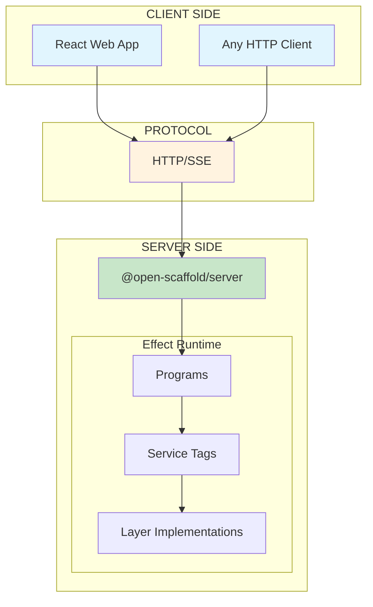
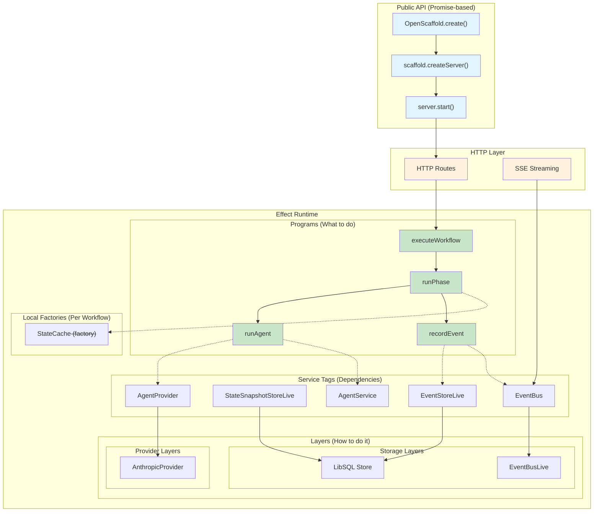
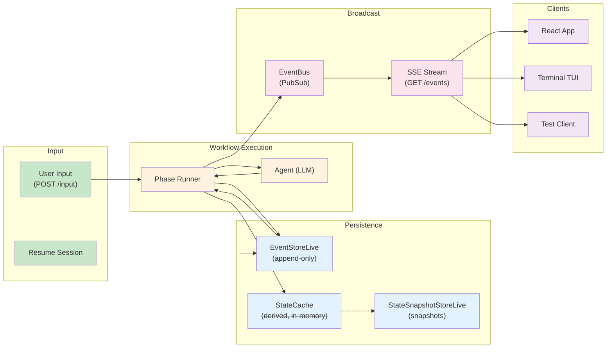
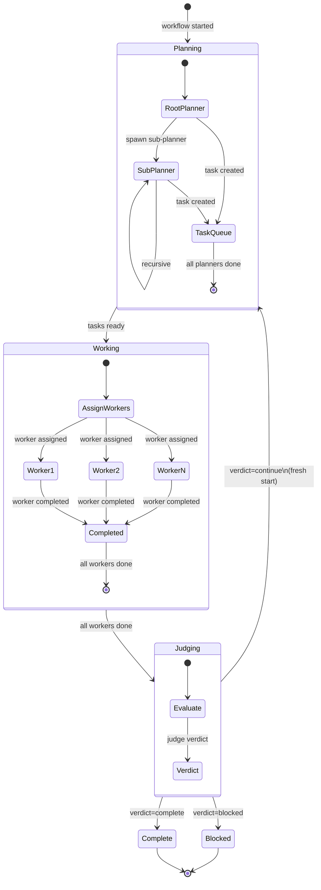
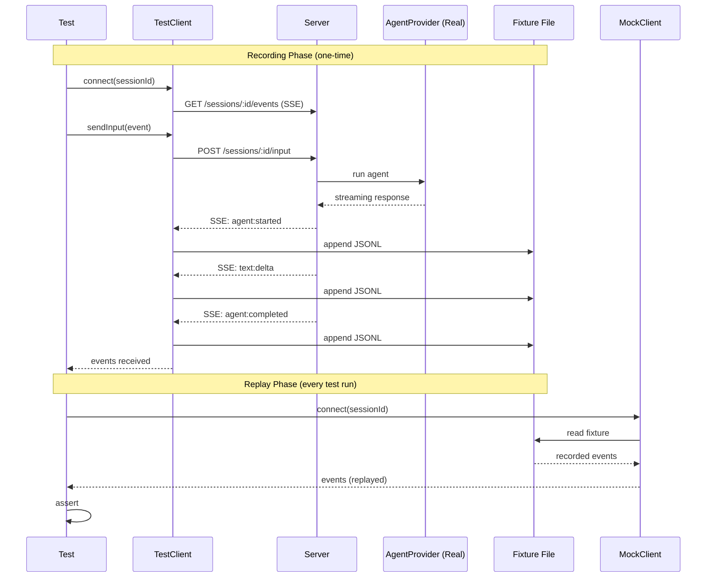
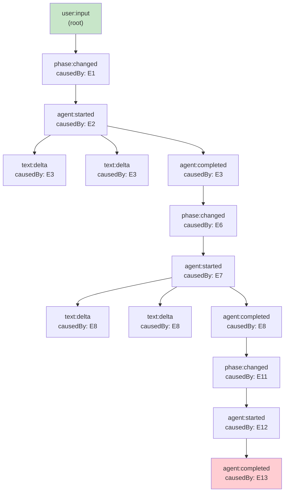

# Core Architecture Diagrams

**Date**: 2026-01-26
**Note**: Server/Client model. See [architecture.md](./architecture.md) for full architecture.

---

## 1. Server/Client Architecture

The fundamental separation: Server runs workflows, Clients connect via HTTP/SSE.

---

## 2. Server Layer Composition

How services compose inside the server.

---

## 3. Protocol Data Flow

How events flow from server to clients via SSE.

---

## 4. Effect Service Dependency Graph

What each program requires.

```mermaid
flowchart TB
    subgraph "Programs"
        executeWorkflow["executeWorkflow"]
        runPhase["runPhase"]
        runAgent["runAgent"]
        recordEvent["recordEvent"]
        createSession["createSession"]
        loadSession["loadSession"]
        computeStateAt["computeStateAt"]
        observeEvents["observeEvents"]
        observeState["observeState"]
        resumeSession["resumeSession"]
        forkSession["forkSession"]
    end

    subgraph "Services"
        ES["EventStoreLive"]
        SSS["StateSnapshotStoreLive"]
        EB["EventBus"]
        AP["AgentProvider"]
        AS["AgentService"]
    end

    subgraph "Factories"
        SC["StateCache<S>"]
    end

    executeWorkflow --> ES & EB & AP & SC
    runPhase --> ES & EB & AP & SC
    runAgent --> AP & AS
    recordEvent --> ES & EB
    createSession --> ES & EB & SC
    loadSession --> ES
    computeStateAt --> ES
    observeEvents --> EB
    observeState --> SC
    resumeSession --> ES & EB & AP & SC
    forkSession --> ES & SC

    style ES fill:#e3f2fd
    style SSS fill:#e3f2fd
    style EB fill:#fce4ec
    style AP fill:#fff3e0
    style AS fill:#fff3e0
    style SC fill:#e3f2fd
```

---

## 5. HTTP Protocol Endpoints

The server's REST + SSE interface.

```mermaid
flowchart TB
    subgraph "Client"
        App["Any Client"]
    end

    subgraph "Session Endpoints"
        POST1["POST /sessions\n(create)"]
        GET0["GET /sessions\n(list)"]
        GET1["GET /sessions/:id/events\n(SSE stream)"]
        GET2["GET /sessions/:id/state\n(current or ?position=N)"]
        POST2["POST /sessions/:id/input\n(send event)"]
        DELETE1["DELETE /sessions/:id\n(end)"]
    end

    subgraph "VCR Endpoints"
        POST3["POST /sessions/:id/pause"]
        POST4["POST /sessions/:id/resume"]
        POST5["POST /sessions/:id/fork"]
    end

    subgraph "Recording Endpoints"
        GET3["GET /recordings\n(list)"]
        GET4["GET /recordings/:id"]
        DELETE2["DELETE /recordings/:id"]
        GET5["GET /providers/status"]
    end

    App --> POST1
    App --> GET0
    App --> GET1
    App --> GET2
    App --> POST2
    App --> DELETE1
    App --> POST3
    App --> POST4
    App --> POST5
    App --> GET3
    App --> GET4
    App --> DELETE2
    App --> GET5

    style POST1 fill:#c8e6c9
    style GET0 fill:#e1f5fe
    style GET1 fill:#e1f5fe
    style GET2 fill:#e1f5fe
    style POST2 fill:#c8e6c9
    style DELETE1 fill:#ffcdd2
    style POST3 fill:#fff3e0
    style POST4 fill:#fff3e0
    style POST5 fill:#fff3e0
    style GET3 fill:#e1f5fe
    style GET4 fill:#e1f5fe
    style DELETE2 fill:#ffcdd2
    style GET5 fill:#e1f5fe
```

---

## 6. Scaffold Workflow State Machine

The Planner/Worker/Judge cycle (example workflow).

---

## 7. TDD Fixture Flow

How fixtures are recorded and replayed.

---

## 8. Event Causality Chain

How events link to each other via causedBy.

---

## Summary

| Diagram | Purpose |
|---------|---------|
| Server/Client Architecture | Shows fundamental separation |
| Server Layer Composition | Shows how services and layers connect inside server |
| Protocol Data Flow | Shows event flow through server to clients |
| Dependency Graph | Shows what each program needs |
| HTTP Protocol Endpoints | Shows the REST + SSE interface |
| State Machine | Shows scaffold workflow phases |
| TDD Fixture Flow | Shows recording and replay |
| Event Causality | Shows event linking |
