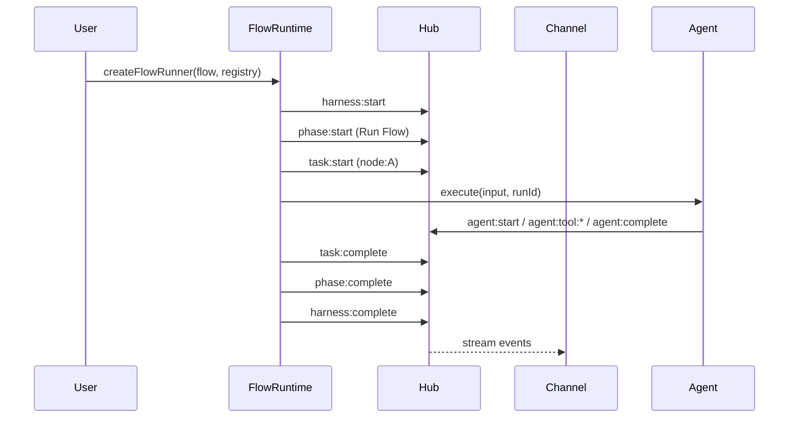

# Flow Runtime Protocol

The Flow runtime is the canonical orchestration layer. It owns lifecycle events, session mode, and inbox routing, and executes a FlowSpec against a Node registry.

## Overview

- **FlowRuntime** is the runtime entry point.
- A Flow run is a **Hub**: it emits events and accepts commands.
- Each **node execution** is wrapped in task scope.
- Each **agent invocation** gets a fresh `runId`.



## Factory

```typescript
const flow = parseFlowYaml(source);
const registry = createRegistryWithNodes();
const instance = createFlowRunner(flow, registry, { sessionId: "flow-001" });
```

## Instance methods

### `attach(channel)`
Attach a channel/adapter. The channel receives the hub and can subscribe/send commands.

### `startSession()`
Enable interactive command handling (send/reply/abort). Returns `this` for chaining.

### `run()`
Execute the flow and return:

```typescript
interface FlowRunResult {
  outputs: Record<string, unknown>;
  events: EnrichedEvent[];
  durationMs: number;
  status: HubStatus;
}
```

## Lifecycle events

The runtime emits the following events:

- `harness:start` / `harness:complete` for the overall run
- `phase:start` / `phase:complete` for the flow phase (default: `Run Flow`)
- `task:start` / `task:complete` / `task:failed` for each node
- `agent:*` events emitted by agent-backed nodes

## Session mode

Session mode enables bidirectional interaction with a running flow:

- `hub.send(...)` emits `session:message`
- `hub.reply(...)` emits `session:reply`
- `hub.abort(...)` emits `session:abort`

Session is **flow-scoped** and not tied to a specific agent run.

## Channels (interfaces)

Channels are **interfaces** to a flow (console, websocket, voice, etc.). They are not nodes and do not appear in the FlowSpec. They are attached at runtime:

```typescript
const instance = createFlowRunner(flow, registry, {
  channels: [ConsoleChannel(), VoiceChannel()],
});
```

**Preferred**: pass channels at creation for deterministic startup order. Use `attach()` only for dynamic, mid-run additions.

## Message routing

- Every agent invocation receives a fresh `runId` for Hub event subscription.
- `hub.sendToRun(runId, message)` emits a `session:message` event with that `runId`.
- Agents subscribe to `session:message` events filtered by their `runId`.
- Optional convenience: `hub.sendTo(nodeId, message)` routes to the latest runId for that node.

## V2 SDK session pattern (agent nodes)

Agent-backed nodes that use the Claude SDK use the **V2 session-based send/receive pattern**:

1. **Create session**: `unstable_v2_createSession({ model })`
2. **Send message**: `await session.send(prompt)`
3. **Receive responses**: `for await (const msg of session.receive()) { ... }`
4. **Multi-turn**: Subscribe to Hub `session:message` events and call `session.send()` for each

This enables true multi-turn behavior and allows `sendToRun(...)` to inject new messages via Hub events.

### Multi-turn pattern (pseudo-code)

```ts
import { unstable_v2_createSession } from "@anthropic-ai/claude-agent-sdk";

async function execute(input: AgentInput, ctx: { hub: Hub; runId: string }): Promise<AgentOutput> {
  const session = unstable_v2_createSession({ model: input.model });

  try {
    // Initial turn
    await session.send(input.prompt);
    await emitResponses(session, ctx.hub);

    // Listen for injected messages
    const unsub = ctx.hub.subscribe("session:message", async (event) => {
      if (event.runId === ctx.runId) {
        await session.send(event.content);
        await emitResponses(session, ctx.hub);
      }
    });

    await waitForDone();
    unsub();
    return result;
  } finally {
    session.close();
  }
}
```

## Multi-turn termination rules

Session-like agent nodes **must stop** without hanging when no messages arrive. Termination can occur by any of the following:

- **maxTurns**: stop after N turns (SDK-level config).
- **explicit close**: the agent calls `session.close()`.
- **timeout**: no `session:message` events arrive within timeout.

**Invariant**: The Flow runtime must not hang waiting for messages. Agents unsubscribe from Hub on completion.

## Claude SDK config dir expectations

- Provider must not write to `~/.claude` in locked environments.
- Agent runtime must support setting `CLAUDE_CONFIG_DIR` to a project-local temp dir (e.g. `.claude-tmp`).
- Do not rely on `CLAUDE_CODE_DEBUG_LOGS_DIR` unless it is set to a valid file path.

## RunId boundaries

- **Fresh runId per agent invocation**.
- Multiple agent runs can occur inside the same task scope.
- Context passing between agents is explicit (inputs/outputs).

## Key invariants

1. **Flow runtime owns lifecycle** — emits `harness:*`, `phase:*`, `task:*`.
2. **Every agent run is injectable** — agents subscribe to Hub `session:message` events by `runId`.
3. **RunId is per invocation** — no implicit agent memory between runs.
4. **Flow run is a Hub** — all hub commands/events apply to the run.
5. **V2 SDK sessions** — agent nodes use `session.send()`/`session.receive()` pattern.
