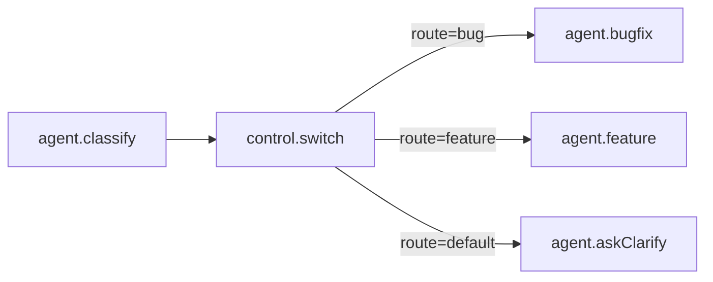

# Edge Routing (Edge-Level `when`)

This document defines how edge-level `when` expressions gate routing between nodes.

## Summary

Edges may include a `when` condition. The condition is evaluated when the **source node completes**. The result determines whether that edge **fires** or is **skipped**.



## Edge schema

```yaml
edges:
  - from: route
    to: bugFlow
    when:
      equals:
        var: route.route
        value: bug
```

`when` uses the existing `WhenExpr` grammar.

## Evaluation context

Edge `when` expressions are evaluated against the binding context:

- `flow.input` (Flow input)
- Node outputs by id (e.g., `route.route`, `classify.label`)

## Node readiness

A node is ready to execute when:

1. **All incoming edges are resolved** (fired or skipped), and
2. **At least one incoming edge fired** (unless the node has no inputs)

If a node has **zero incoming edges**, it is eligible at run start.

## Merge semantics

`control.merge` can override readiness rules:

- `mode: all` → wait for **all** incoming edges to fire.
- `mode: any` → wait for **any** incoming edge to fire.

**Note**: In sequential scheduling (MVP), `mode: any` is effectively the same as `mode: all` because nodes are evaluated in topological order. `mode: any` becomes observable only when parallel scheduling is enabled.

## Skip behavior

If all incoming edges are skipped:
- The node is **skipped**.
- The runtime records a skip marker in outputs.

## Failure interaction

- Edge `when` is evaluated even if the source node failed, unless `failFast` ends the run.
- If a node output is an error marker (due to `continueOnError`), `when` can still inspect it.

## Key invariants

1. Edge `when` is evaluated once per source completion.
2. A node never runs unless at least one incoming edge fired.
3. Edge routing does not reorder the DAG; it only gates execution.
