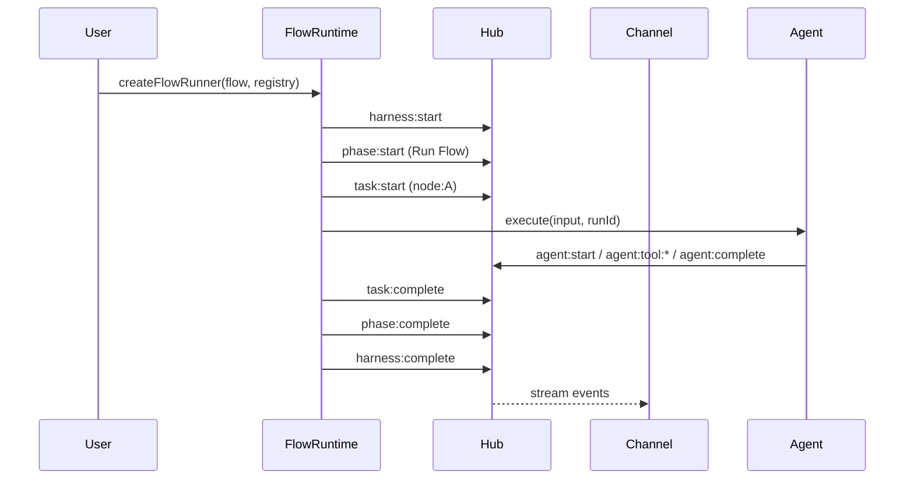

# Flow Runtime Protocol

The Flow runtime is the canonical orchestration layer. It owns lifecycle events, session mode, and inbox routing, and executes a FlowSpec against a Node registry.

## Overview

- **FlowRuntime** replaces Harness as the runtime entry point.
- A Flow run is a **Hub**: it emits events and accepts commands.
- Each **node execution** is wrapped in task scope.
- Each **agent invocation** gets a fresh `runId`.



## Factory

```typescript
const flow = parseFlowYaml(source);
const registry = createRegistryWithNodes();
const instance = createFlowRunner(flow, registry, { sessionId: "flow-001" });
```

## Instance methods

### `attach(channel)`
Attach a channel/adapter. The channel receives the hub and can subscribe/send commands.

### `startSession()`
Enable interactive command handling (send/reply/abort). Returns `this` for chaining.

### `run()`
Execute the flow and return:

```typescript
interface FlowRunResult {
  outputs: Record<string, unknown>;
  events: EnrichedEvent[];
  durationMs: number;
  status: HubStatus;
}
```

## Lifecycle events

The runtime emits the following events:

- `harness:start` / `harness:complete` for the overall run
- `phase:start` / `phase:complete` for the flow phase (default: `Run Flow`)
- `task:start` / `task:complete` / `task:failed` for each node
- `agent:*` events emitted by agent-backed nodes

## Session mode

Session mode enables bidirectional interaction with a running flow:

- `hub.send(...)` emits `session:message`
- `hub.reply(...)` emits `session:reply`
- `hub.abort(...)` emits `session:abort`

Session is **flow-scoped** and not tied to a specific agent run.

## Channels (interfaces)

Channels are **interfaces** to a flow (console, websocket, voice, etc.). They are not nodes and do not appear in the FlowSpec. They are attached at runtime:

```typescript
const instance = createFlowRunner(flow, registry, {
  channels: [ConsoleChannel(), VoiceChannel()],
});
```

**Preferred**: pass channels at creation for deterministic startup order. Use `attach()` only for dynamic, mid-run additions.

## Inbox routing

- Every agent invocation receives an `AgentInbox`.
- The runtime maps `runId → inbox` for the duration of that agent run.
- `hub.sendToRun(runId, message)` injects into that inbox.
- Optional convenience: `hub.sendTo(nodeId, message)` routes to the latest runId for that node.

## RunId boundaries

- **Fresh runId per agent invocation**.
- Multiple agent runs can occur inside the same task scope.
- Context passing between agents is explicit (inputs/outputs).

## Key invariants

1. **Flow runtime owns lifecycle** — emits `harness:*`, `phase:*`, `task:*`.
2. **Every agent run is injectable** — inbox exists for all agent nodes.
3. **RunId is per invocation** — no implicit agent memory between runs.
4. **Flow run is a Hub** — all hub commands/events apply to the run.
