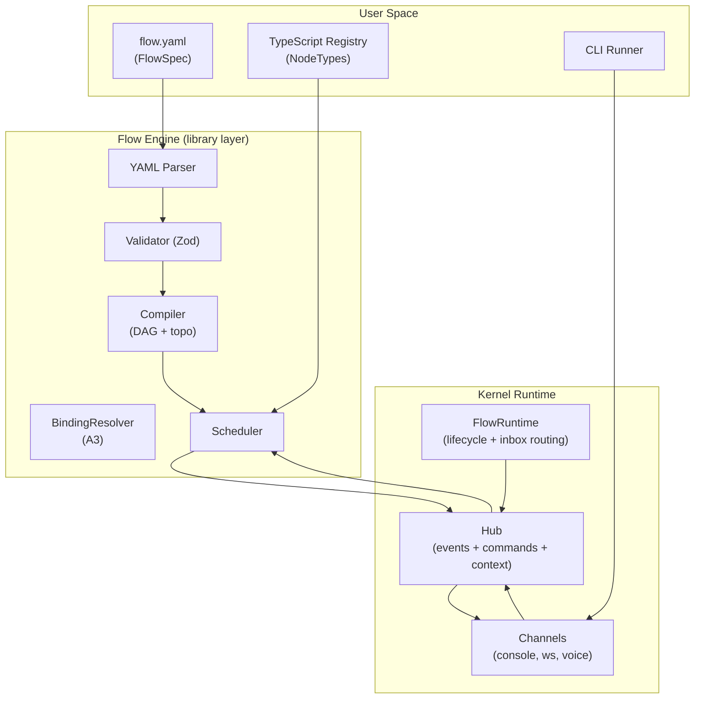

# Kernel + Flow Protocol (Draft, Flow-Only)

This is a **draft update** of the canonical kernel docs to align with Flow-only execution. It mirrors the existing format but changes core invariants.

## Purpose

This spec defines:
- **Kernel protocol**: the minimal runtime substrate (Hub, FlowRuntime, Agent, Channel)
- **Flow protocol**: declarative YAML DAG execution layer built on the kernel

The kernel provides the event bus, lifecycle management, and bidirectional communication primitives. The flow layer provides structured orchestration (DAG scheduling, conditional execution, bindings) that runs *inside the Flow runtime* (no Harness).

## Canonical naming

### Kernel primitives

- **Hub**: unified bidirectional bus
  - Events out: `subscribe(...)`, async iteration
  - Commands in: `send/sendTo/sendToRun/reply/abort`
  - Context propagation: `scoped(...)`, `current()`
- **FlowRuntime**: orchestrator that owns lifecycle, phase/task helpers, and inbox routing
- **Agent**: executable unit (`AgentDefinition.execute(...)`) that emits `agent:*` events and returns a result
- **Channel**: bidirectional adapter/attachment (console/websocket/voice/etc.) that observes events and sends commands

### Flow layer

- **FlowSpec**: YAML definition of a DAG (`flow`, `nodes`, `edges`)
- **FlowRun**: one execution of a FlowSpec
- **NodeSpec**: one node instance in the graph (`id`, `type`, `input`, `when`, `policy`, `config`)
- **NodeType**: the TypeScript implementation registered under `node.type`

## Architecture overview

**Key invariant**: Flow is the only runtime. There is no legacy runtime layer.

## Spec modules (draft)

### Kernel protocol

- [Events](spec/events.md)
- [Hub](spec/hub.md)
- [Flow Runtime](spec/flow-runtime.md)
- [Agent](spec/agent.md)
- [Channel](spec/channel.md)

### Flow protocol

- [FlowSpec](flow/flow-spec.md)
- [Bindings](flow/bindings.md)
- [When](flow/when.md)
- [Execution](flow/execution.md)
- [Registry](flow/registry.md)
- [Node Catalog](../flow/node-catalog.md)
- [Edge Routing](../flow/edge-routing.md)

### Reference

- [Protocol Types](reference/protocol-types.md)
