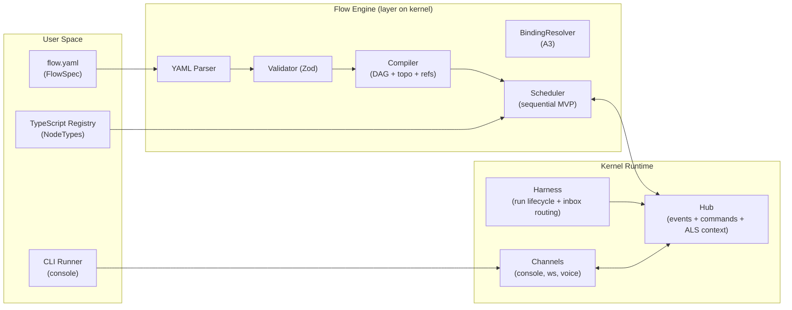

# OpenHarness Spike Docs (Unified)

This is the **single, canonical documentation** for the `spikes/kernel` spike.

It describes **one unified system** with two layers:

- **Kernel layer (runtime substrate)**: `Hub` + `Harness` + `Agent` + `Channel` + event model
- **Flow layer (YAML DAG)**: a declarative **FlowSpec** that runs *inside* a harness, using the kernel’s events and lifecycle helpers

---

## Canonical naming (use these terms everywhere)

### Kernel primitives

- **Hub**: the unified, bidirectional bus
  - **events out**: `subscribe(...)`, async iteration
  - **commands in**: `send/sendTo/sendToRun/reply/abort`
- **Harness**: orchestrator that owns:
  - **state**
  - **run lifecycle**
  - **phase/task helpers**
  - **inbox routing** for `sendToRun(...)`
- **Agent**: executable unit (`AgentDefinition.execute(...)`) that can emit `agent:*` and returns a result
- **Channel**: bidirectional adapter/attachment (console/websocket/voice/etc.)

### Flow layer (Option B)

We avoid “workflow” for the YAML DAG concept (it’s too overloaded).

- **FlowSpec**: YAML definition of a DAG (`flow`, `nodes`, `edges`)
- **FlowRun**: one execution of a FlowSpec (runs inside a harness run)
- **NodeSpec**: one node instance in the graph (`id`, `type`, `input`, `when`, `policy`, `config`)
- **NodeType**: the TypeScript implementation registered under `node.type`

---

## Kernel: event model

### One canonical envelope

All events are emitted via the hub and delivered in a single envelope:

```ts
type EnrichedEvent = {
  id: string;
  timestamp: Date;
  context: EventContext;
  event: BaseEvent;
}
```

### Minimal event types (kernel contract)

- **Harness lifecycle**: `harness:start`, `harness:complete`
- **Phase lifecycle**: `phase:start`, `phase:complete`, `phase:failed`
- **Task lifecycle**: `task:start`, `task:complete`, `task:failed`
- **Agent lifecycle**: `agent:start`, `agent:complete`
  - optional/common: `agent:text`, `agent:thinking`, `agent:tool:start`, `agent:tool:complete`
- **Interactive/session (optional)**: `session:prompt`, `session:reply`, `session:abort`, `session:message`

The key invariant: **everything flows through the hub**; channels never “print directly” without observing hub events.

---

## Kernel: API (public surface)

### `defineHarness({ name, agents, state, run })`

The harness factory creates an instance that is also a `Hub`:

- `.attach(channel)` — attach a channel/adapter
- `.startSession()` — enable interactive command handling
- `.run()` — execute and return `{ result, state, events, durationMs, status }`

### Hub commands (bidirectional)

- `hub.send(message)` — general message into the session
- `hub.sendTo(agentName, message)` — convenience injection (only safe if exactly one run is active)
- `hub.sendToRun(runId, message)` — correct run-scoped injection
- `hub.reply(promptId, response)` — answer a prompt
- `hub.abort(reason?)` — abort the session/run

### Agent contract

Kernel-registered agents implement:

```ts
export interface AgentDefinition<TIn, TOut> {
  name: string;
  emitsStartComplete?: boolean;
  execute(input: TIn, ctx: { hub: Hub; inbox: AgentInbox; runId: string }): Promise<TOut>;
}
```

**Important**: `runId` is the routing key for `hub.sendToRun(runId, ...)`.

---

## Flow layer: YAML contract (FlowSpec)

### Top-level shape (B1 edges, required)

```yaml
flow:
  name: string
  version: number                # default: 1
  description: string?           # optional
  input: object?                 # optional default inputs
  policy:
    failFast: boolean            # default: true

nodes:
  - id: string
    type: string                 # NodeTypeId (registry key)
    input: object                # templating allowed in string fields
    config: object?              # freeform; node-type-specific
    when: WhenExpr?              # optional gating
    policy: NodePolicy?          # optional per-node policy

edges:
  - from: string                 # NodeId
    to: string                   # NodeId
```

### Control flow

- **Edges are explicit** (B1): `edges` is required; the graph is never inferred from ordering or bindings.
- **Conditional execution**: `when` gates execution; false → node is skipped.

### Binding / templating (A3)

Bindings apply to **string values only** inside `node.input`.

- `{{path}}` — **strict**; missing is an error
- `{{?path}}` — **optional**; missing renders `""`
- `{{path | default:<json>}}` — fallback when missing (`default:` is JSON literal)

Paths resolve against the binding context:

- `flow.input.<key...>`
- `<nodeId>.<key...>` (node outputs)

### WhenExpr (MVP)

```yaml
when:
  equals:
    var: "some.path"
    value: true

when:
  not: <WhenExpr>

when:
  and: [<WhenExpr>, <WhenExpr>]

when:
  or: [<WhenExpr>, <WhenExpr>]
```

---

## How Flow runs on the Kernel (execution semantics)

In MVP terms, the Flow engine is just **structured orchestration inside a harness run**:

- The harness uses `phase("Run Flow", ...)`.
- Each node is wrapped as `task("node:<id>", ...)`.
- Nodes that call LLM providers are executed via `AgentDefinition.execute(...)` and stream `agent:*` events.

This preserves the “one system” property: **Flow is not a new runtime**, it is a *library layer* that uses the kernel runtime.

---

## Diagrams (Mermaid)

### Components



---

## Where to look in code

- Kernel runtime:
  - `src/hub.ts`
  - `src/harness.ts`
  - `src/agent.ts`
  - `src/channel.ts`
  - `src/events.ts`
- Reference provider adapter:
  - `src/anthropic.ts`
- YAML/Flow demo (current spike example):
  - `examples/run-yaml-workflow.ts`
  - `examples/workflow.benin.yaml`

