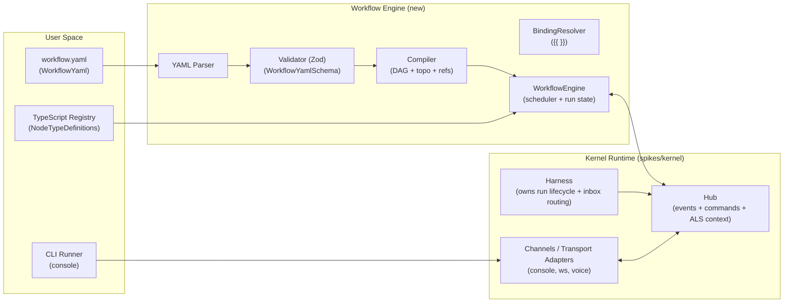
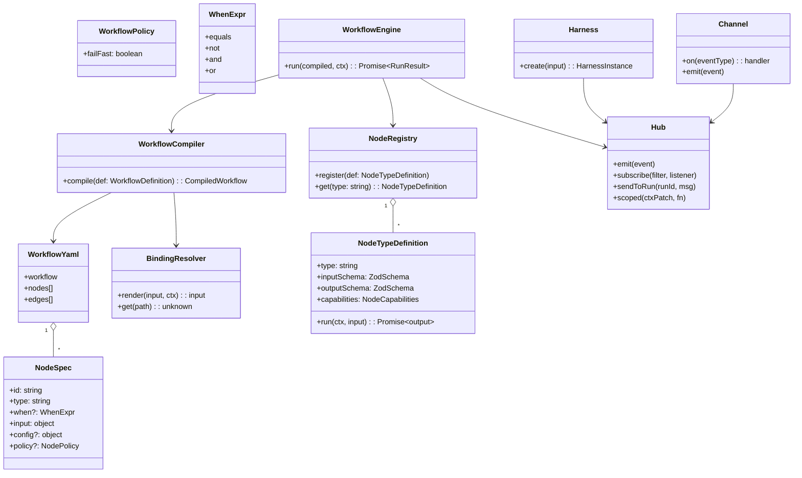
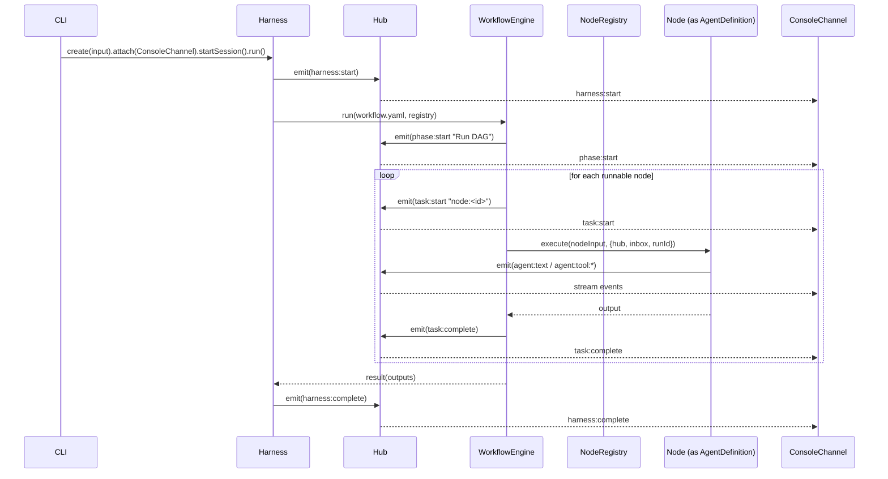
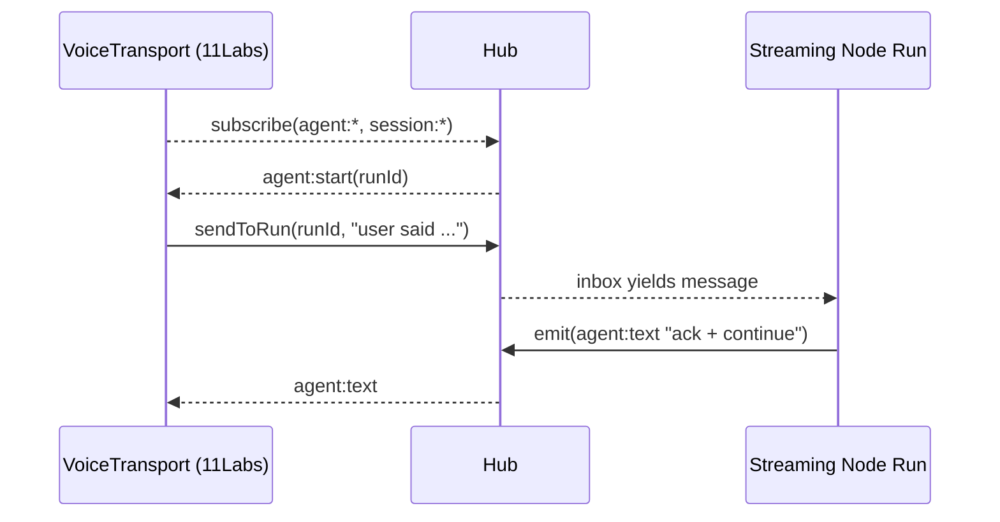

# Workflow Engine UML (Mermaid)

These diagrams are “UML-ish” via Mermaid to keep them editable in Markdown.

---

## Component diagram (high-level)

---

## Class diagram (major abstractions)

---

## Sequence diagram: CLI runs a YAML workflow

---

## Sequence diagram: realtime transport steers a running node

